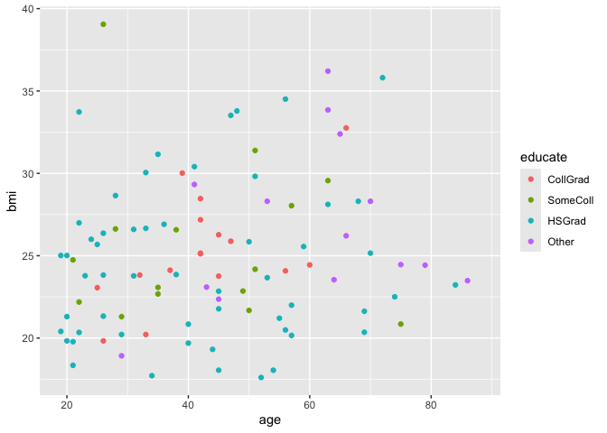
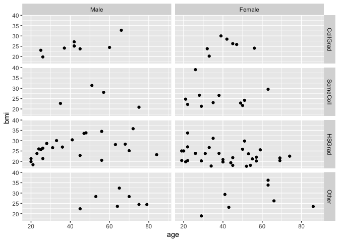

For Module 1, we will learn how to create data visualizations using the package `ggplot2`. `ggplot2` uses the **grammar of graphics**, which is a system for describing and building graphics.

When making a statistical or data graphic, you need to consider both what to include in the graphic, and how to write the code to produce the graphic that you want. We focus mostly on the latter question in this class, but the former is arguably more important and harder! 

*Note:* These class activities are adapted from "R for Data Science" by Grolemund and Wickham, chapter 2.

`ggplot2` is a core package in the `tidyverse` group of packages.  We will use this group of packages throughout the semester.  The following command will load the `tidyverse` group of packages; you can see `ggplot2` among the list of packages loaded in the output below.  We will learn about many of the other packages later in this course.


``` r
library(tidyverse)
```

```
## ── Attaching core tidyverse packages ──────────────────────── tidyverse 2.0.0 ──
## ✔ dplyr     1.1.4     ✔ readr     2.1.5
## ✔ forcats   1.0.0     ✔ stringr   1.5.1
## ✔ ggplot2   3.5.1     ✔ tibble    3.2.1
## ✔ lubridate 1.9.4     ✔ tidyr     1.3.1
## ✔ purrr     1.0.2     
## ── Conflicts ────────────────────────────────────────── tidyverse_conflicts() ──
## ✖ dplyr::filter() masks stats::filter()
## ✖ dplyr::lag()    masks stats::lag()
## ℹ Use the conflicted package (<http://conflicted.r-lib.org/>) to force all conflicts to become errors
```

Now let's load some data to work with:


``` r
load("nmesSub.rda")
```

The command above loaded a datafile that was saved into an file called `nmesSub.rda`.  If you look in the "Environment" window (upper right) in Rstudio, you will now see there's an object called `nmes.data` available for you to use in your R workspace. 

We can take a look at this data by simply typing the name of the data:


``` r
nmes.data
```

```
## # A tibble: 100 × 18
##       id totalexp lc5   chd5   eversmk current former packyears yearsince   bmi
##    <int>    <dbl> <fct> <fct>  <fct>   <fct>   <fct>      <dbl>     <int> <dbl>
##  1 35339   1874.  No LC No CHD Yes     no      Yes        0.450        22  28.5
##  2 32648    125   No LC No CHD Yes     no      Yes        0.5           2  27.0
##  3 37857   1026.  No LC No CHD Yes     no      Yes       36            16  28.3
##  4  6247    644.  No LC No CHD no      <NA>    no         0             0  24.4
##  5  3006    134   No LC No CHD Yes     Yes     no         3             0  21.3
##  6  1813   7281.  No LC No CHD Yes     Yes     no        12             0  21.3
##  7  6129     56.7 No LC No CHD no      <NA>    no         0             0  28.3
##  8  2278   7333.  No LC No CHD Yes     Yes     no         7.5           0  23.8
##  9 35435    156   No LC No CHD Yes     Yes     no        21             0  28.3
## 10 11022   1430.  No LC No CHD Yes     Yes     no         6             0  26.4
## # ℹ 90 more rows
## # ℹ 8 more variables: beltuse <fct>, educate <fct>, marital <int>, poor <fct>,
## #   age <dbl>, female <fct>, mscd <chr>, ageCat <fct>
```

This `nmes.data` object is a data frame, which is a collection of observations (in the rows) across different variables (in the columns).  This data frame contains information on adults collected through the National Medical Expenditures Survey (NMES).  We will use this data in the main PH Biostats course at some point.

**We are going to use this data to answer a question: Do older adults tend to have higher body mass index (BMI) than younger adults?**

To answer our question, we will use two of these variables: 

* `age`: survey respondant's age
* `bmi`: survey respondant's body mass index

To answer our question, we can make a plot that puts `age` on the x-axis and `bmi` on the y-axis:

``` r
ggplot(data = nmes.data) +
  geom_point(mapping = aes(x = age, y = bmi))
```

```
## Warning: Removed 1 row containing missing values or values outside the scale range
## (`geom_point()`).
```

<!-- -->

There's not necessarily a clear pattern here!  But let's talk more about the code we used to make this plot.

1. First we begin a plot with the `ggplot()` function.  This creates a coordinate system that we add layers to.  We give the `ggplot()` function the dataset we want to use to make the graph.  This by itself just creates an empty plot.  Try it!

``` r
ggplot(data = nmes.data)
```

<!-- -->

2. Next we add a layer to our graph.  Since we want to add points to our plot to make a scatterplot, we use the function `geom_point()` to add a layer of points. There are lots of other `geom` functions to add different layers in different situations.

Each `geom` function has a `mapping` argument that defines how the variables are *mapped* to the visual characteristics of the graph.  The mapping is defined using an aesthetic, `aes()`.  The `x` and `y` arguments of the `aes()` function specify which variables to use for the x and y axes.  The function will look to the dataset defined in the first `ggplot()` function, in this case `nmes.data`, to find the variables it needs for x and y, in this case `age` and `bmi`.


``` r
ggplot(data = nmes.data) +
  geom_point(mapping = aes(x = age, y = bmi))
```

```
## Warning: Removed 1 row containing missing values or values outside the scale range
## (`geom_point()`).
```

<!-- -->

### General template for a `ggplot2` graph

So far we have the following general template for a `ggplot2` graph.  We will add other layers to this plot throughout this module.


``` r
ggplot(data = <DATA>) + 
  <GEOM_FUNCTION>(mapping = aes(<MAPPINGS>))
```

#### Practice

(1) How many rows (observations) are in the `nmes.data` dataset?  How many columns (variables)?


(2) Make a scatterplot of `totalexp` against `age`.  Describe the relationship that you see.


(3) Make a scatterplot of `bmi` against `educate`. Is this plot useful?


(4) Make a scatterplot of `eversmk` against `educate`. Is this plot useful?


### Aesthetic mappings

Let's get back to our original scatterplot that looks at the relationship between `bmi` and `age`:

``` r
ggplot(data = nmes.data) +
  geom_point(mapping = aes(x = age, y = bmi))
```

```
## Warning: Removed 1 row containing missing values or values outside the scale range
## (`geom_point()`).
```

<!-- -->

What if we wanted to add a third variable, like `educate` to our plot?  We can do this by mapping this third variable to an aesthetic.  Remember than an aesthetic is a visual property of the objects in our graph; so far we have mapped `age` to the x coordinates and `bmi` to the y coordinates.  But we could also map a variable to a property like the *color* or *shape* of the points.  To do this, we assign the aesthetic to a third variable.  First color:

``` r
ggplot(data = nmes.data) +
  geom_point(mapping = aes(x = age, y = bmi, color = educate))
```

```
## Warning: Removed 1 row containing missing values or values outside the scale range
## (`geom_point()`).
```

<!-- -->

Then shape:

``` r
ggplot(data = nmes.data) +
  geom_point(mapping = aes(x = age, y = bmi, shape = educate))
```

```
## Warning: Removed 1 row containing missing values or values outside the scale range
## (`geom_point()`).
```

<!-- -->

Other aesthetics for a scatterplot include the *size* of the points and the *alpha* or transparency of the points.

#### Practice

(5) Make a scatterplot of `bmi` against `age` but map `educate` to the *size* aesthetic.  Describe your plot.  Do you think this is a useful mapping choice?  Hint: read the warning message in your R console for help.


(6) Make a scatterplot of `bmi` against `age` but map `educate` to the *alpha* aesthetic.  Describe your plot.  Do you think this is a useful mapping choice?


(7) Make a scatterplot of `bmi` against `age` but map `educate` to both the *color* and *shape* aesthetics.  What does this do?


(8) Make a scatterplot of `bmi` against `age` but map `totalexp` to the *color* aesthetic.  What does this do?  What happens when you map `totalexp` to *shape* or *size*?  


(9) Try the code below. Can you figure out what it is doing?

``` r
ggplot(data = nmes.data) +
  geom_point(mapping = aes(x = age, y = bmi, color = totalexp > 2000))
```

```
## Warning: Removed 1 row containing missing values or values outside the scale range
## (`geom_point()`).
```

<!-- -->


### Setting aesthetics manually for all points

You can also set the aesthetics manually for all points, for example if you want all the points to be red:

``` r
ggplot(data = nmes.data) +
  geom_point(mapping = aes(x = age, y = bmi), color = "red")
```

```
## Warning: Removed 1 row containing missing values or values outside the scale range
## (`geom_point()`).
```

<!-- -->

Notice that to manually set the aesthetics, you map them OUTSIDE of the `aes()` function.  Only aesthetics that are mapped to variables (things that vary across observations) go inside the `aes()` function; aesthetics that apply to all observations go outside!


``` r
ggplot(data=nmes.data) +
  geom_point(mapping = aes(x = age, y = bmi), color = "red", fill="blue", size=4, shape="triangle filled")
```

```
## Warning: Removed 1 row containing missing values or values outside the scale range
## (`geom_point()`).
```

<!-- -->

You can see a full list of options for these aesthetics at [https://ggplot2.tidyverse.org/articles/ggplot2-specs.html](https://ggplot2.tidyverse.org/articles/ggplot2-specs.html).

#### Practice:

(10) What's wrong with this code?  Why are the points in the resulting plot not green?

``` r
ggplot(data = nmes.data) +
  geom_point(mapping = aes(x = age, y = bmi, color = "green"))
```

```
## Warning: Removed 1 row containing missing values or values outside the scale range
## (`geom_point()`).
```

<!-- -->

(11) Design your own plot of `bmi` against `age` where you manually set the aesthetics to be the color, shape, and size of your choice.


### Adding facets

Instead of mapping the aesthetics to a third variable, we could instead split the graph on a third variable using **facets**.  This creates subsets of the data based on the faceting variable(s) and then generates one plot for each data subset. We do this with the `facet_wrap()` function.


``` r
ggplot(data = nmes.data) +
  geom_point(mapping = aes(x = age, y = bmi)) +
  facet_wrap(~ educate, nrow=2)
```

```
## Warning: Removed 1 row containing missing values or values outside the scale range
## (`geom_point()`).
```

<!-- -->

We give the `facet_wrap()` function a **formula** that specifies the variable we want to split on by using `~ variable`.  We should only facet on a discrete variable, not a continuous one!

To facet by 2 variables together, we use the `facet_grid()` function. We also specify a formula for this function of the form `rowvariable ~ columnvariable`:

``` r
ggplot(data = nmes.data) +
  geom_point(mapping = aes(x = age, y = bmi)) +
  facet_grid(female ~ educate)
```

```
## Warning: Removed 1 row containing missing values or values outside the scale range
## (`geom_point()`).
```

<!-- -->

The choice of which variable to facet into the rows and which to facet into the columns depends on which comparison you are hoping to make.  The plot above is nice for comparing males to females within an education level.  If we wanted to compare education levels within males, we might switch the faceting:

``` r
ggplot(data = nmes.data) +
  geom_point(mapping = aes(x = age, y = bmi)) +
  facet_grid(educate ~ female)
```

```
## Warning: Removed 1 row containing missing values or values outside the scale range
## (`geom_point()`).
```

<!-- -->

Why is this second plot easier to compare education levels across males than the first one?

#### Practice

(12) What happens if you facet on a continous variable like `totalexp`?


(13) What do the empty cells in the plot below mean?

``` r
ggplot(data = nmes.data) +
  geom_point(mapping = aes(x = age, y = bmi)) +
  facet_grid(marital ~ female)
```

```
## Warning: Removed 1 row containing missing values or values outside the scale range
## (`geom_point()`).
```

<!-- -->

(14) What do the following plots do?  Can you guess what the `.` means?

``` r
ggplot(data = nmes.data) +
  geom_point(mapping = aes(x = age, y = bmi)) +
  facet_grid( . ~ female)
```

```
## Warning: Removed 1 row containing missing values or values outside the scale range
## (`geom_point()`).
```

<!-- -->

``` r
ggplot(data = nmes.data) +
  geom_point(mapping = aes(x = age, y = bmi)) +
  facet_grid(educate ~ .)
```

```
## Warning: Removed 1 row containing missing values or values outside the scale range
## (`geom_point()`).
```

<!-- -->

(15) Read the help file for `facet_wrap()` by typing `?facet_wrap` at the command prompt.  What does `nrow` do?  What does `ncol` do?  What other options could you use to control the layout of the individual panels?  Why doesn't `facet_grid()` have `nrow` and `ncol` options?


### Geometric objects

We can use different geometric objects, or **geoms** to display the same data in different ways.  For example, consider the following 3 plots:

``` r
ggplot(data = nmes.data) +
  geom_point(mapping = aes(x = age, y = bmi))
```

```
## Warning: Removed 1 row containing missing values or values outside the scale range
## (`geom_point()`).
```

<!-- -->

``` r
ggplot(data = nmes.data) +
  geom_smooth(mapping = aes(x = age, y = bmi))
```

```
## `geom_smooth()` using method = 'loess' and formula = 'y ~ x'
```

```
## Warning: Removed 1 row containing non-finite outside the scale range
## (`stat_smooth()`).
```

<!-- -->

``` r
ggplot(data = nmes.data) +
  geom_rug(mapping = aes(x = age, y = bmi))
```

<!-- -->

The code for all three plots is the same except for the choice of **geom** used to display the data. Different geoms help us see different features about our data.  What features do we see in each of these three plots?

All three of these geoms take an x and y aesthetic, but not all of the aesthetics we learned for `geom_point()` will work with the other two.  It doesn't make sense to set a **shape** aesthetic for a line, but it does make sense to set a **color** aesthetic!  And we have additional aesthetics for this type of geom, like **linetype**.

``` r
ggplot(data = nmes.data) +
  geom_smooth(mapping = aes(x = age, y = bmi, color = educate))
```

```
## `geom_smooth()` using method = 'loess' and formula = 'y ~ x'
```

```
## Warning: Removed 1 row containing non-finite outside the scale range
## (`stat_smooth()`).
```

<!-- -->

``` r
ggplot(data = nmes.data) +
  geom_smooth(mapping = aes(x = age, y = bmi, linetype = educate))
```

```
## `geom_smooth()` using method = 'loess' and formula = 'y ~ x'
```

```
## Warning: Removed 1 row containing non-finite outside the scale range
## (`stat_smooth()`).
```

<!-- -->

And we can combine two geoms on the same graph as well by simply adding another geom layer.

``` r
ggplot(data = nmes.data) +
  geom_point(mapping = aes(x = age, y = bmi, color = educate)) +
  geom_smooth(mapping = aes(x = age, y = bmi, color = educate))
```

```
## `geom_smooth()` using method = 'loess' and formula = 'y ~ x'
```

```
## Warning: Removed 1 row containing non-finite outside the scale range
## (`stat_smooth()`).
```

```
## Warning: Removed 1 row containing missing values or values outside the scale range
## (`geom_point()`).
```

<!-- -->

``` r
ggplot(data = nmes.data) +
  geom_point(mapping = aes(x = age, y = bmi, color = educate)) +
  geom_smooth(mapping = aes(x = age, y = bmi, color = educate),  se=FALSE)
```

```
## `geom_smooth()` using method = 'loess' and formula = 'y ~ x'
```

```
## Warning: Removed 1 row containing non-finite outside the scale range (`stat_smooth()`).
## Removed 1 row containing missing values or values outside the scale range
## (`geom_point()`).
```

<!-- -->

Notice in the last plot I removed the shaded confidence bands around the lines to make the plot cleaner.  This is an option for the `geom_smooth()` function that can be discovered with `?geom_smooth`.

As you can see, you add multiple geoms to the same graph by *adding* them in your code with a plus sign (`+`).  We can clean this code up by moving shared information (such as the x, y, and color aesthetics) to the main `ggplot()` function.


``` r
ggplot(data = nmes.data, mapping = aes(x = age, y = bmi, color = educate)) +
  geom_point() +
  geom_smooth(se=FALSE)
```

```
## `geom_smooth()` using method = 'loess' and formula = 'y ~ x'
```

```
## Warning: Removed 1 row containing non-finite outside the scale range
## (`stat_smooth()`).
```

```
## Warning: Removed 1 row containing missing values or values outside the scale range
## (`geom_point()`).
```

<!-- -->

Any mappings that you define in the main `ggplot()` function will hold for all of the geoms that follow; these are called **global** mappings.  You can still extend or overwrite a mapping for a particular layer by defining them within the specific geom.  These are called **local** mappings:


``` r
ggplot(data = nmes.data, mapping = aes(x = age, y = bmi)) +
  geom_point(mapping = aes(color = educate)) +
  geom_smooth(se=FALSE)
```

```
## `geom_smooth()` using method = 'loess' and formula = 'y ~ x'
```

```
## Warning: Removed 1 row containing non-finite outside the scale range
## (`stat_smooth()`).
```

```
## Warning: Removed 1 row containing missing values or values outside the scale range
## (`geom_point()`).
```

<!-- -->

There are lots of different geoms in the `ggplot2` packages and there's a handy cheatsheet available that summarizes them; you can download it from [https://rstudio.github.io/cheatsheets/data-visualization.pdf](https://rstudio.github.io/cheatsheets/data-visualization.pdf); it's called the "Data Visualization Cheatsheet."  You'll notice that it breaks the geoms up by the type of data you are trying to display.  When looking at the relationship between `bmi` and `age` we are working with two continuous variables, so our geom options are the ones listed in the "Two variables: both continuous" section. 

#### Practice

(16) Look at the code below and make a prediction about what the resulting graph will look like.  Then run the code and check your prediction:

``` r
ggplot(data = nmes.data, mapping = aes(x = age, y = bmi, color = female)) +
  geom_point() +
  geom_rug()
```

```
## Warning: Removed 1 row containing missing values or values outside the scale range
## (`geom_point()`).
```

<!-- -->

(17) What does the `show.legend = FALSE` option do in the code below?

``` r
ggplot(data = nmes.data, mapping = aes(x = age, y = bmi, color = female)) +
  geom_point() +
  geom_smooth()
```

```
## `geom_smooth()` using method = 'loess' and formula = 'y ~ x'
```

```
## Warning: Removed 1 row containing non-finite outside the scale range
## (`stat_smooth()`).
```

```
## Warning: Removed 1 row containing missing values or values outside the scale range
## (`geom_point()`).
```

<!-- -->

``` r
ggplot(data = nmes.data, mapping = aes(x = age, y = bmi, color = female)) +
  geom_point(show.legend = FALSE) +
  geom_smooth()
```

```
## `geom_smooth()` using method = 'loess' and formula = 'y ~ x'
```

```
## Warning: Removed 1 row containing non-finite outside the scale range (`stat_smooth()`).
## Removed 1 row containing missing values or values outside the scale range
## (`geom_point()`).
```

<!-- -->

``` r
ggplot(data = nmes.data, mapping = aes(x = age, y = bmi, color = female)) +
  geom_point() +
  geom_smooth(show.legend = FALSE)
```

```
## `geom_smooth()` using method = 'loess' and formula = 'y ~ x'
```

```
## Warning: Removed 1 row containing non-finite outside the scale range (`stat_smooth()`).
## Removed 1 row containing missing values or values outside the scale range
## (`geom_point()`).
```

<!-- -->

``` r
ggplot(data = nmes.data, mapping = aes(x = age, y = bmi, color = female)) +
  geom_point(show.legend = FALSE) +
  geom_smooth(show.legend = FALSE)
```

```
## `geom_smooth()` using method = 'loess' and formula = 'y ~ x'
```

```
## Warning: Removed 1 row containing non-finite outside the scale range (`stat_smooth()`).
## Removed 1 row containing missing values or values outside the scale range
## (`geom_point()`).
```

<!-- -->
