For Module 1, we are learning how to create data visualizations using the package `ggplot2`. `ggplot2` uses the **grammar of graphics**, which is a system for describing and building graphics

*Note:* These class activities are adapted from "R for Data Science" by Grolemund and Wickham, chapter 3.

First we will load the `tidyverse` group of packages to have access to `ggplot2`.


``` r
library(tidyverse)
```

```
## ── Attaching core tidyverse packages ──────────────────────── tidyverse 2.0.0 ──
## ✔ dplyr     1.1.4     ✔ readr     2.1.5
## ✔ forcats   1.0.0     ✔ stringr   1.5.1
## ✔ ggplot2   3.5.1     ✔ tibble    3.2.1
## ✔ lubridate 1.9.4     ✔ tidyr     1.3.1
## ✔ purrr     1.0.2     
## ── Conflicts ────────────────────────────────────────── tidyverse_conflicts() ──
## ✖ dplyr::filter() masks stats::filter()
## ✖ dplyr::lag()    masks stats::lag()
## ℹ Use the conflicted package (<http://conflicted.r-lib.org/>) to force all conflicts to become errors
```

Next we load our datafile with the National Medical Expenditures Survey (NMES) data subset.  


``` r
load("nmesSub.rda")
```

You can see what's in the data set by typing the dataset's name.  You can also type `View(nmes.data)` in the console window to view the entire data set at once.  This will open the dataset up in a separate tab next to this .Rmd file.


``` r
nmes.data
```

```
## # A tibble: 100 × 18
##       id totalexp lc5   chd5   eversmk current former packyears yearsince   bmi
##    <int>    <dbl> <fct> <fct>  <fct>   <fct>   <fct>      <dbl>     <int> <dbl>
##  1 35339   1874.  No LC No CHD Yes     no      Yes        0.450        22  28.5
##  2 32648    125   No LC No CHD Yes     no      Yes        0.5           2  27.0
##  3 37857   1026.  No LC No CHD Yes     no      Yes       36            16  28.3
##  4  6247    644.  No LC No CHD no      <NA>    no         0             0  24.4
##  5  3006    134   No LC No CHD Yes     Yes     no         3             0  21.3
##  6  1813   7281.  No LC No CHD Yes     Yes     no        12             0  21.3
##  7  6129     56.7 No LC No CHD no      <NA>    no         0             0  28.3
##  8  2278   7333.  No LC No CHD Yes     Yes     no         7.5           0  23.8
##  9 35435    156   No LC No CHD Yes     Yes     no        21             0  28.3
## 10 11022   1430.  No LC No CHD Yes     Yes     no         6             0  26.4
## # ℹ 90 more rows
## # ℹ 8 more variables: beltuse <fct>, educate <fct>, marital <int>, poor <fct>,
## #   age <dbl>, female <fct>, mscd <chr>, ageCat <fct>
```

Remember here's the general template for a `ggplot2` graphic we started with: 

``` r
ggplot(data = <DATA>) + 
  <GEOM_FUNCTION>(mapping = aes(<MAPPINGS>))
```

Eventually we will end up with a full template that looks like this:

``` r
ggplot(data = <DATA>) + 
  <GEOM_FUNCTION>(
     mapping = aes(<MAPPINGS>),
     stat = <STAT>, 
     position = <POSITION>
  ) +
  <COORDINATE_FUNCTION> +
  <FACET_FUNCTION>
```

We have already talked about *geoms*, *mappings*, and *facets*.  Now we will add in the rest.  Finally, we will finish with some tips to make publication-ready graphics. 

### Bar charts

So far we have looked at the relationship between two continuous variables -- `bmi` and `age`.  Now let's switch to a categorical variable -- `beltuse`.

For a single discrete variable like `beltuse`, we will need to use the bar geom, `geom_bar()`:


``` r
ggplot(data = nmes.data) + 
  geom_bar(mapping = aes(x = beltuse))
```

<!-- -->

We see that most people in our data set always wear their seatbelt. 

Looking at the mapping in our `geom_bar()` function, we see the x aesthetic is mapped to `beltuse`, but we haven't mapped anything to the y aesthetic.  On our graph, the y-axis is showing something called `count`, which is NOT a variable in our dataset.  Instead, this is a value created by the `geom_bar()` function to display on the graph.  For a bar chart, this is the count of observations that fall into each of the categories of `beltuse`.  For example, 25 individuals rarely wear their seatbelt.

Because of this, we say that the `geom_bar()` function has transformed the data from the raw data to a summarized set of data as shown below.  (Don't worry about the code to do this -- we will learn about it in Module 2!)


``` r
nmes.data %>%
  group_by(beltuse) %>%
  summarize(count=n())
```

```
## # A tibble: 3 × 2
##   beltuse count
##   <fct>   <int>
## 1 Rare       25
## 2 Some       17
## 3 Always     58
```

This transformed data is what is actually being plotted with the `geom_bar()` function: the `beltuse` of this transformed data is mapped to the x aesthetic and the `count` of this transformed data is mapped to the y aesthetic.

The default transformation (called a **stat**) for the `geom_bar()` geom is `count` and we could get the same graph if we explicitly mapped this count to the y aesthetic:

``` r
ggplot(data = nmes.data) + 
  geom_bar(mapping = aes(x = beltuse, y = stat(count)))
```

```
## Warning: `stat(count)` was deprecated in ggplot2 3.4.0.
## ℹ Please use `after_stat(count)` instead.
## This warning is displayed once every 8 hours.
## Call `lifecycle::last_lifecycle_warnings()` to see where this warning was
## generated.
```

<!-- -->

When mapping one of these stat transformations to an aesthetic, we put `stat()` around the name.

If we wanted to graph the proportions in each category instead of the counts, we would need a different transformation.  The `geom_bar()` function also calculates a proportion for each category, with the `prop` stat.  We can instead map that to the y aesthetic, but we also have to specify which groups we want to calculate the proportions relative to.  If we want the proportions overall, we use `group = 1`:

``` r
ggplot(data = nmes.data, mapping = aes(group = 1)) + 
  geom_bar(mapping = aes(x = beltuse, y = stat(prop)))
```

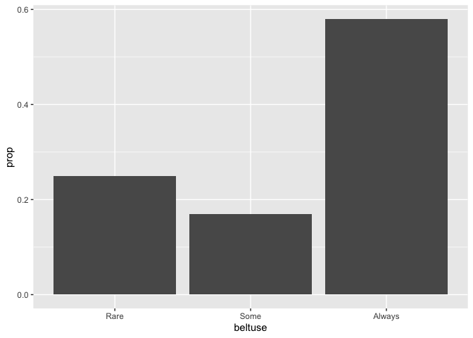<!-- -->

There are lots of other stat transformations in `ggplot2` that are relevant to different geoms, and we will see more of them later.  You can find a full lists of these stats on the `ggplot2` cheat sheet. However, for making bar charts the two most useful ones are `count` and `prop`.


#### Practice

1. Make a bar chart that shows the proportion of individuals in our data set with and without a major smoking-caused disease (`mscd`).


### Position adjustments

Suppose we want to look at the relationship between 2 categorical variables, say between `eversmk` and `beltuse`.  Here `eversmk` tells whether or not the individual has ever been a smoker.  We can do this by mapping the second variable `eversmk` to a different aesthetic, like color or fill:

``` r
ggplot(data = nmes.data) + 
  geom_bar(mapping = aes(x = beltuse, y = stat(count), color = eversmk))
```

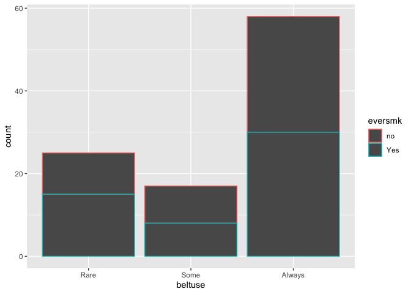<!-- -->

``` r
ggplot(data = nmes.data) + 
  geom_bar(mapping = aes(x = beltuse, y = stat(count), fill = eversmk))
```

<!-- -->


Is this a useful plot for comparing the proportion of smokers across the different levels of seat seatbelt use?  We can compare the heights of the blue bars easily, but it's hard to compare the red ones because they don't start at the same place. We have some control over this with what are called position adjustments.

The default **position** for a bar chart is `"stack"`, which stacks the groups on top of each other.  Other options for the position argument are `"dodge"`, `"identity"`, or `"fill"`.  Let's see what each of these does:

First the default `position="stack"` gives us the same plot as before:

``` r
ggplot(data = nmes.data) + 
  geom_bar(mapping = aes(x = beltuse, y = stat(count), fill = eversmk), position = "stack")
```

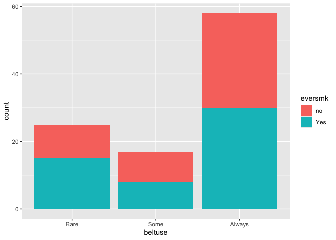<!-- -->

The option `position="dodge"` unstacks our barplots, which makes it easier to compare across groups:

``` r
ggplot(data = nmes.data) + 
  geom_bar(mapping = aes(x = beltuse, y = stat(count), fill = eversmk), position = "dodge")
```

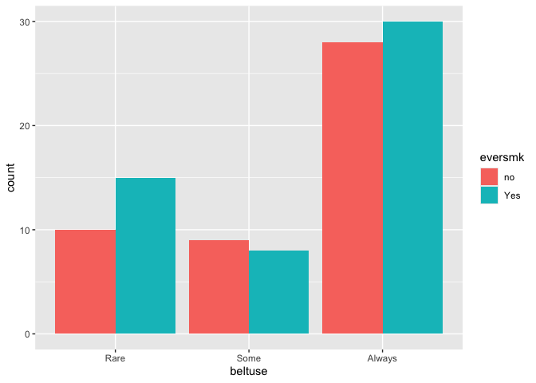<!-- -->

Next the option `position="identity"`:

``` r
ggplot(data = nmes.data) + 
  geom_bar(mapping = aes(x = beltuse, y = stat(count), fill=eversmk), position = "identity")
```

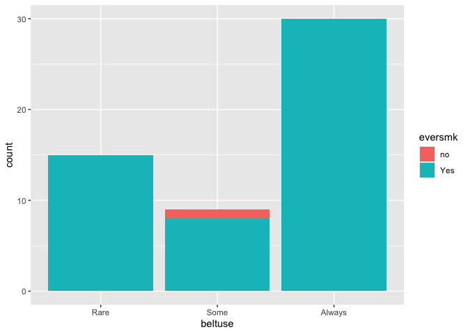<!-- -->

It's hard to see what exactly is happening here without also changing the *alpha* aesthetic to be more transparent.  Remember that putting the *alpha* aesthetic outside the `aes()` function means it applies to the entire layer of the graph.

``` r
ggplot(data = nmes.data) + 
  geom_bar(mapping = aes(x = beltuse, y = stat(count), fill = eversmk), 
           position = "identity", alpha = .3)
```

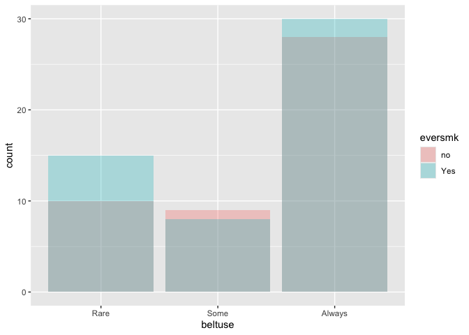<!-- -->

Here we can see that the identity option also unstacks the bars, like dodge, but places them both at the same spot instead of next to each other, so the bars overlap each other.  This option is mostly useful for two-dimensional geoms, like `geom_point()` rather than the one-dimensional bar charts we are working with.  In fact, this is the default position for the `geom_point()` function we worked with last week!

[Side note: In the code above you can also see that I added a line break to make the code more readable.  Instead of having one long line with all the commands, I separated into multiple lines so that the code wouldn't run off the end of the code chunk window.  This is a good tip to make code more readable.  You can still run the entire code chunk by clicking the green arrow, or by placing your cursor anywhere on any of the three lines of code and doing Control + Enter.]   

Finally, let's look at the option `position="fill"`:

``` r
ggplot(data = nmes.data) + 
  geom_bar(mapping = aes(x = beltuse, y = stat(count), fill = eversmk), position = "fill")
```

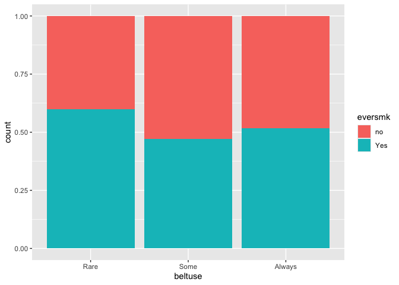<!-- -->

This option is like stack, but makes each set of stacked bars the same height.  This essentially turns the y-axis into a proportion and makes it easy to compare proportions across groups.

#### Practice

2. Make a bar chart that allows you to compare the proportion of individuals with a major smoking-caused disease (`mscd`) between those who have and haven't ever smoked (`eversmk`).


### Coordinate systems

The last piece to our visualization package is the coordinate system, which controls how the x and y aesthetics work.  The default coordinate system is the Cartesian coordinate system which allows the x and y positions to act independently to determine a position on the graph.  This is the typical coordinate system you are familiar with, where a (x,y) point determines position on the axes.

Although there are lots of different coordinate systems in `ggplot2`, only a few coordinate functions will likely be useful to you at this point.  They are `coord_flip()` and `coord_cartesian()`.  Let's see what they do:


``` r
ggplot(data = nmes.data) +
  geom_point(mapping = aes(x = age, y = bmi)) +
  coord_flip()
```

```
## Warning: Removed 1 row containing missing values or values outside the scale range
## (`geom_point()`).
```

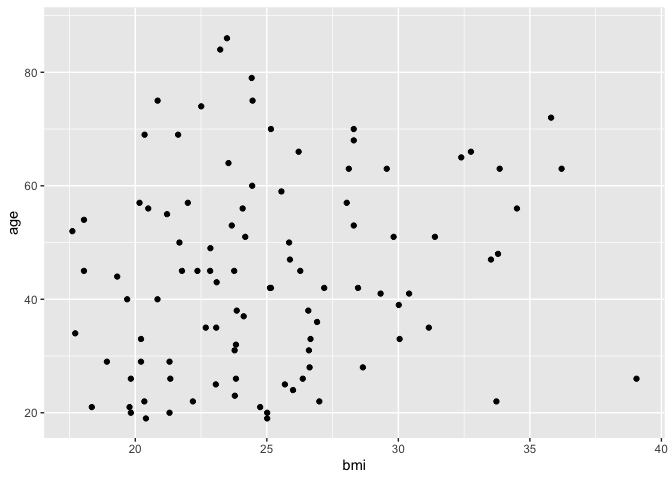<!-- -->

``` r
ggplot(data = nmes.data) + 
  geom_bar(mapping = aes(x = beltuse, y = stat(count), fill = eversmk), position = "fill") + 
  coord_flip()
```

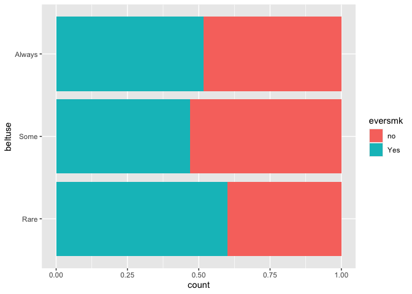<!-- -->

Basically `coord_flip()` switches the x and y axes.


The `coord_cartesian()` option is the default option, so doesn't generally need to be specified in your graph.  However, it can also be used to **zoom in** on a specific region of the graph.  Here we want to zoom in on our larger plot to see the section for ages 40 through 60.

``` r
ggplot(data = nmes.data) +
  geom_point(mapping = aes(x = age, y = bmi)) +
  coord_cartesian(xlim = c(40, 60))
```

```
## Warning: Removed 1 row containing missing values or values outside the scale range
## (`geom_point()`).
```

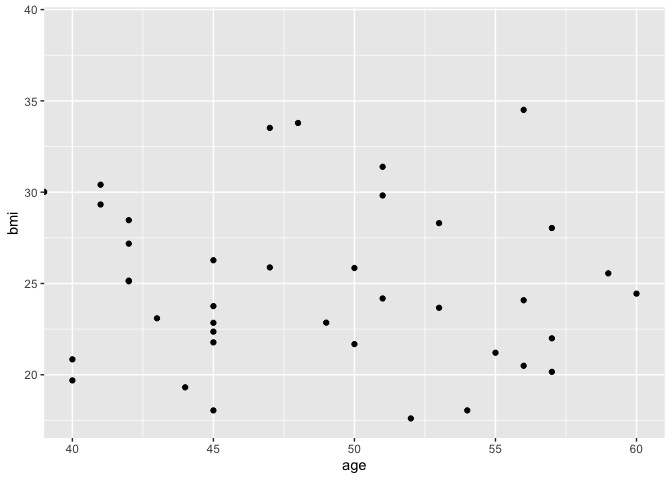<!-- -->

#### Practice

3. Flip the coordinates on your bar chart that compares the proportion of individuals with a major smoking-caused disease (`mscd`) between those who have and haven't ever smoked (`eversmk`).


4. Create a zoomed-in scatterplot of `bmi` vs. `age` with only bmi values between 20-25 and only ages between 40-60.


### Pulling it all together -- the layered language of graphics

With the addition of transformations (**stat**), position adjustments (**position**), and coordinate systems to our **geoms** and faceting, we can extend our general form of a graph as shown below.  With these pieces, you can build just about any plot you would like to make!


``` r
ggplot(data = <DATA>) + 
  <GEOM_FUNCTION>(
     mapping = aes(<MAPPINGS>),
     stat = <STAT>, 
     position = <POSITION>
  ) +
  <COORDINATE_FUNCTION> +
  <FACET_FUNCTION>
```


### Boxplots

Let's try this out with a new type of geom that we haven't seen before -- the boxplot.

Suppose we want to look at the relationship between a continuous variable (`totalexp`) and a categorical variable (`eversmk`).  We can see from the cheatsheet at [https://raw.githubusercontent.com/rstudio/cheatsheets/main/data-visualization.pdf](https://raw.githubusercontent.com/rstudio/cheatsheets/main/data-visualization.pdf) that one of the geoms to show this type of relationship is `geom_boxplot()`.  We can start with the basic ggplot structure:

``` r
ggplot(data = nmes.data) +
  geom_boxplot(mapping = aes(x = eversmk, y = totalexp))
```

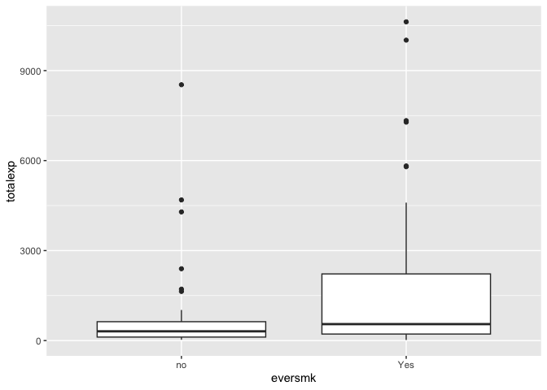<!-- -->

Maybe then we want to flip our coordinate system so the boxplots go the other direction:

``` r
ggplot(data = nmes.data) +
  geom_boxplot(mapping = aes(x = eversmk, y = totalexp)) + 
  coord_flip()
```

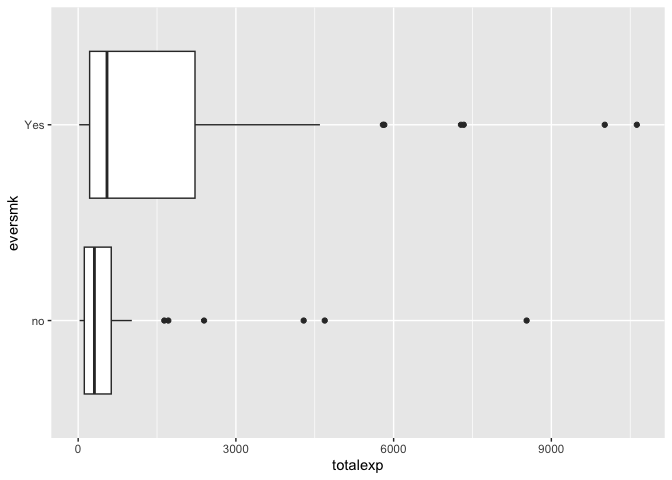<!-- -->

Try the following things using this new `geom_boxplot()` geom.

#### Practice

5. Make a graphic that shows the relationship between total medical expenditures (`totalexp`) and smoking (`eversmk`) separately for the three seat-belt groups.


6. Make a graphic that shows the relationship between total medical expenditures (`totalexp`) and smoking (`eversmk`) separately for the three seat-belt groups, where the boxplots are colored differently for the different smoking (`eversmk`) groups.


7. Flip the coordinates of the graph you made in 6.


8. If you type `?geom_boxplot` in the console window to open the help file for this geom, you'll see there is an option called `varwidth` with a default value of `FALSE`.  What happens if you set this option to `TRUE`?  Create the two plots with the code below, and also scroll down through the help file to see what it says about `varwidth`.

``` r
ggplot(data = nmes.data) +
  geom_boxplot(mapping = aes(x = mscd, y = totalexp), varwidth = FALSE)
```

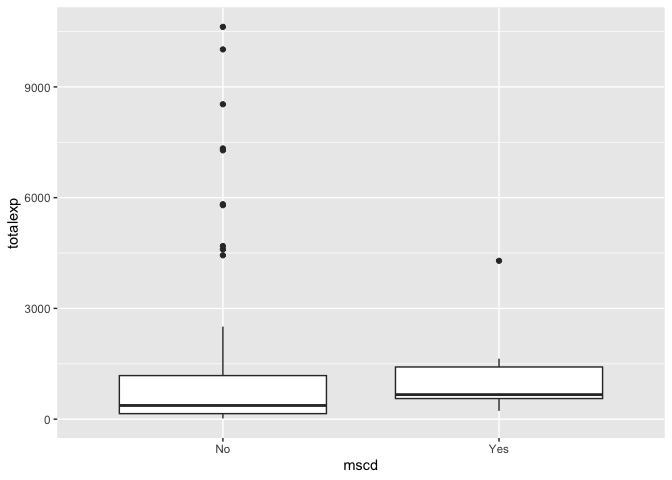<!-- -->

``` r
ggplot(data = nmes.data) +
  geom_boxplot(mapping = aes(x = mscd, y = totalexp), varwidth = TRUE)
```

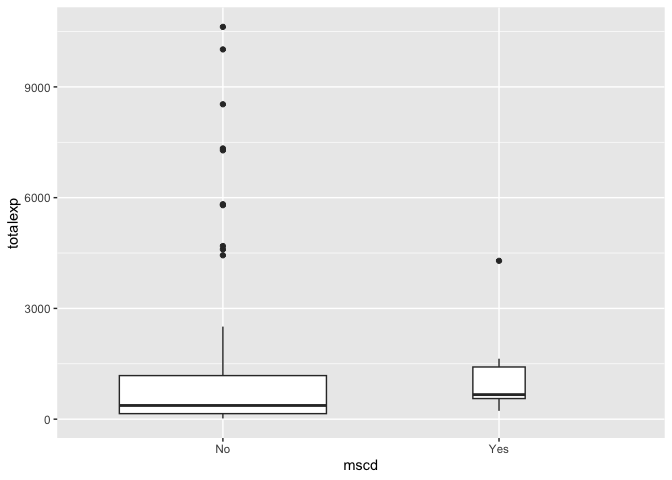<!-- -->

### Publication quality graphics

There are lots of options in `ggplot2` to create nice-looking graphics that could be used in papers or reports.  You can read more about these in Chapter 28 of "R for Data Science" by Grolemund and Wickham, which you can find at [https://r4ds.had.co.nz/graphics-for-communication.html](https://r4ds.had.co.nz/graphics-for-communication.html).

Today we will look at two of these options which will be helpful for your assignment:

(1) Changing the labels on the graph
(2) Changing the location of legends on a graph

### Graph labels

We add labels with the `labs()` function.  The `title` option adds an overall title to the graph:

``` r
ggplot(data = nmes.data) +
  geom_point(mapping = aes(x = age, y = bmi)) + 
  labs(title = "BMI increases with age")
```

```
## Warning: Removed 1 row containing missing values or values outside the scale range
## (`geom_point()`).
```

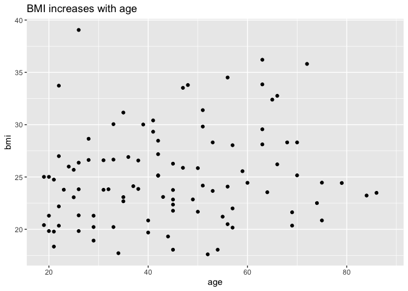<!-- -->

There is also a `subtitle` option:

``` r
ggplot(data = nmes.data) +
  geom_point(mapping = aes(x = age, y = bmi)) + 
  labs(title = "BMI increases with age",
       subtitle = "Data based on a subsample from NMES")
```

```
## Warning: Removed 1 row containing missing values or values outside the scale range
## (`geom_point()`).
```

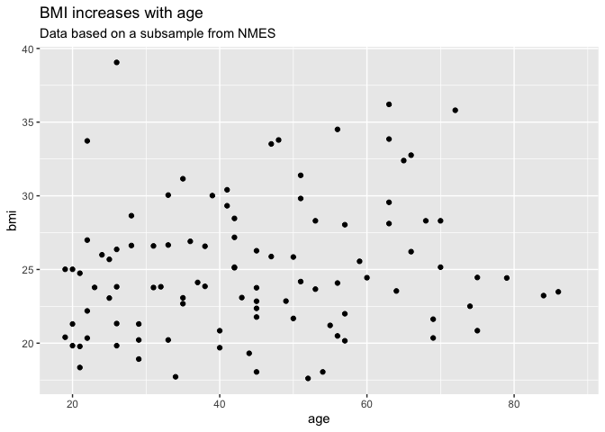<!-- -->

Notice the use of line breaks to make the code easy to read!

We can also add labels to the x and y axes:

``` r
ggplot(data = nmes.data) +
  geom_point(mapping = aes(x = age, y = bmi)) + 
  labs(
    title = "BMI increases with age",
    x = "Age (years)",
    y = "Body Mass Index (BMI)"
    )
```

```
## Warning: Removed 1 row containing missing values or values outside the scale range
## (`geom_point()`).
```

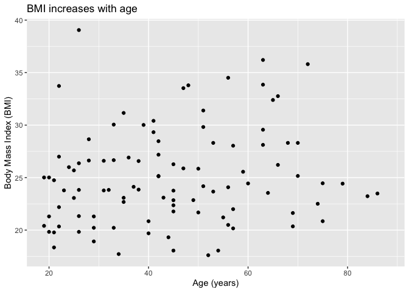<!-- -->

And we can add labels to the legends of a third aesthetic, like color, shape, or fill:

``` r
ggplot(data = nmes.data) +
  geom_point(mapping = aes(x = age, y = bmi, color = poor)) + 
  labs(
    title = "BMI increases with age",
    x = "Age (years)",
    y = "Body Mass Index (BMI)",
    color = "Poverty status"
    )
```

```
## Warning: Removed 1 row containing missing values or values outside the scale range
## (`geom_point()`).
```

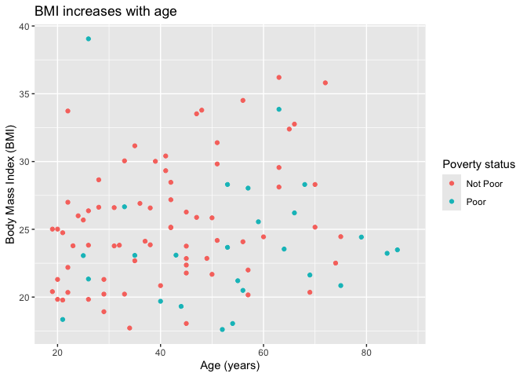<!-- -->

### Legend location

We can change the position of a legend on a graph using the `theme()` setting.  (You can do **a lot** with themes, we will only touch on them briefly for now!)

The default location for a legend is to the right of the graph:

``` r
ggplot(data = nmes.data) +
  geom_point(mapping = aes(x = age, y = bmi, color = poor)) + 
  labs(
    title = "BMI increases with age",
    x = "Age (years)",
    y = "Body Mass Index (BMI)",
    color = "Poverty status"
    )
```

```
## Warning: Removed 1 row containing missing values or values outside the scale range
## (`geom_point()`).
```

<!-- -->

We can move it using the `legend.position` option within the `theme()` function:

``` r
ggplot(data = nmes.data) +
  geom_point(mapping = aes(x = age, y = bmi, color = poor)) + 
  labs(
    title = "BMI increases with age",
    x = "Age (years)",
    y = "Body Mass Index (BMI)",
    color = "Poverty status"
    ) +
  theme(legend.position = "left")
```

```
## Warning: Removed 1 row containing missing values or values outside the scale range
## (`geom_point()`).
```

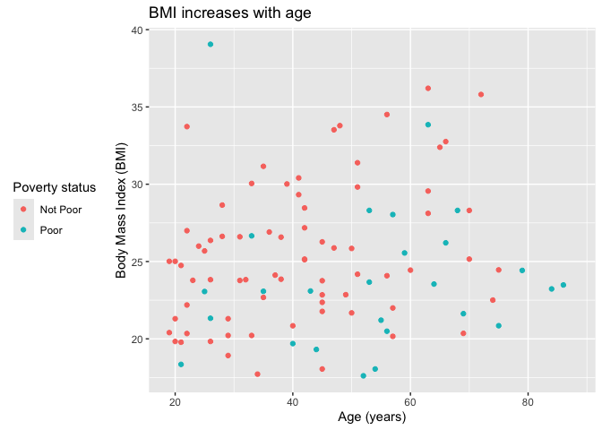<!-- -->

Options for `legend.position` include: "top", "bottom", "right", "left", "none"

Try them below by changing the position:

``` r
ggplot(data = nmes.data) +
  geom_point(mapping = aes(x = age, y = bmi, color = poor)) + 
  labs(
    title = "BMI increases with age",
    x = "Age (years)",
    y = "Body Mass Index (BMI)",
    color = "Poverty status"
    ) +
  theme(legend.position = "top")
```

```
## Warning: Removed 1 row containing missing values or values outside the scale range
## (`geom_point()`).
```

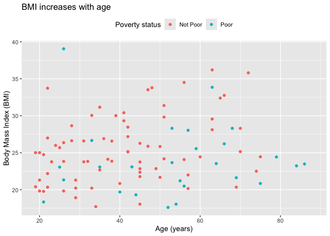<!-- -->
