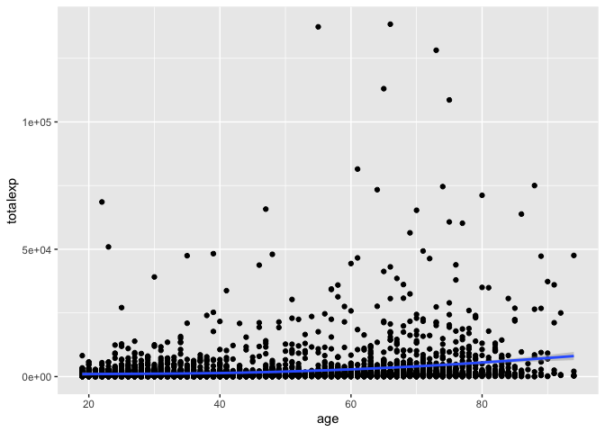
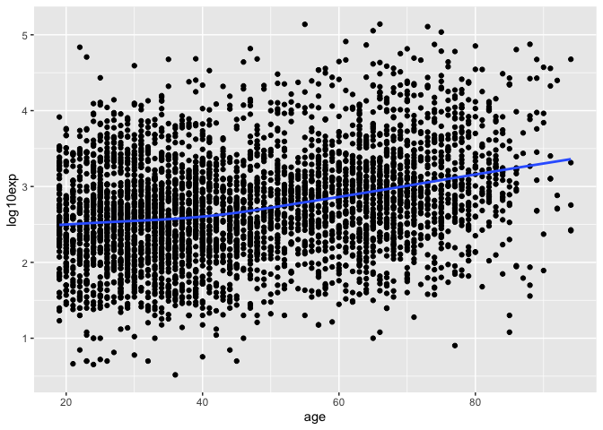
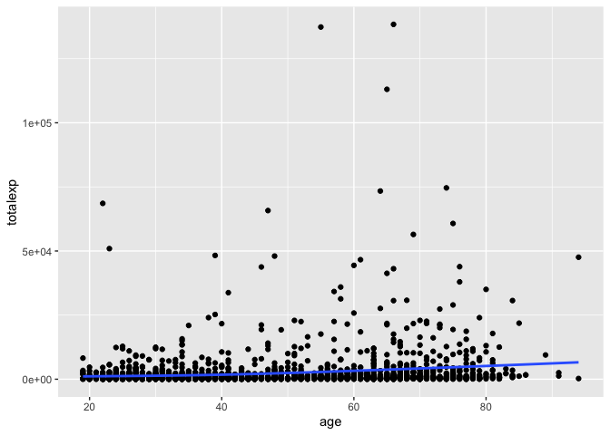
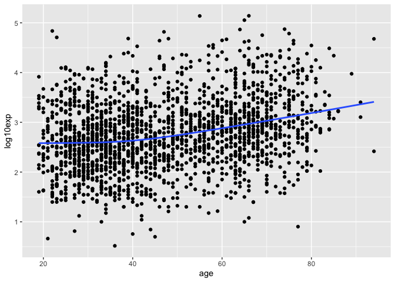
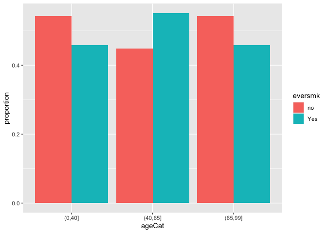
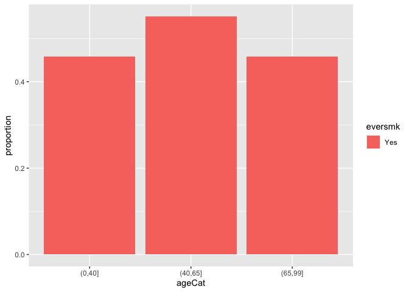

In Module 2, we are learning how to transform data using the package `dplyr`. `dplyr` is part of the `tidyverse` and provides a set of verbs for manipulating and transforming data.

*Note:* These class activities are adapted from "R for Data Science" by Grolemund and Wickham, chapter 5.  You can find this chapter [here](https://r4ds.had.co.nz/transform.html)

Load the `tidyverse` group of packages to have access to `dplyr` and the full NMES dataset:

``` r
library(tidyverse)
```

```
## ── Attaching core tidyverse packages ──────────────────────── tidyverse 2.0.0 ──
## ✔ dplyr     1.1.4     ✔ readr     2.1.5
## ✔ forcats   1.0.0     ✔ stringr   1.5.1
## ✔ ggplot2   3.5.1     ✔ tibble    3.2.1
## ✔ lubridate 1.9.4     ✔ tidyr     1.3.1
## ✔ purrr     1.0.2     
## ── Conflicts ────────────────────────────────────────── tidyverse_conflicts() ──
## ✖ dplyr::filter() masks stats::filter()
## ✖ dplyr::lag()    masks stats::lag()
## ℹ Use the conflicted package (<http://conflicted.r-lib.org/>) to force all conflicts to become errors
```

``` r
load("nmes2018.rda")
```

In this module we are learning about 6 key functions from the `dplyr` package for working with data: 

* `filter()` allows us to choose *observations* by their values; useful for defining subsets of the data that meet certain criteria
* `arrange()` allows us to order rows in the data based on some criteria
* `select()` allows us to choose *variables* from the dataset
* `mutate()` allows us to create new variables out of existing variables
* `summarize()` allows us to collapse values into a summary, such as collapsing individual values of a variable into the mean value or the sum of the values
* `group_by()` allows us to perform any of the previous 5 function on a group-by-group basis, for example summarizing to calculate a mean value for each group

A reminder that all 6 of these function have a similar syntax:

* The first argument is a data frame (or tibble)
* The next arguments describe what to do with the data frame by referring to names of variables in the data set
* The result of the function is a new data frame

We talked about `filter()`, `arrange()`, `select()`, and `mutate()` last week.  This week we will look at `group_by()` and `summarize()` and learn how to work with these functions in combination!

# Grouped summaries with `summarize()` and `group_by()`

The `summarize()` function condenses a data frame into a single row containing summary information calculated from the variables.  The first argument of this function is again a data frame and the following arguments name and define the summaries to be calculated from the data.


``` r
summarize(nmes.data, mean_exp = mean(totalexp))
```

```
## # A tibble: 1 × 1
##   mean_exp
##      <dbl>
## 1    2297.
```

We can do multiple summaries at once:

``` r
summarize(nmes.data, mean_exp = mean(totalexp), sd_exp = sd(totalexp), mean_bmi = mean(bmi), min_bmi = min(bmi), max_bmi = max(bmi))
```

```
## # A tibble: 1 × 5
##   mean_exp sd_exp mean_bmi min_bmi max_bmi
##      <dbl>  <dbl>    <dbl>   <dbl>   <dbl>
## 1    2297.  7416.       NA      NA      NA
```

Notice that we get `NA` as our summaries for the `bmi` variable.  This is because the `bmi` variable has missing values.  To get summaries that exclude the missing values, we can use the `na.rm = TRUE` option in these functions.  We can also add some line breaks in our code so that it's easier to read.  Note that RStudio automatically indents new lines of code to match the code before, so all the new summarized variables line up with each other!

``` r
summarize(nmes.data, 
          mean_exp = mean(totalexp), 
          sd_exp = sd(totalexp), 
          mean_bmi = mean(bmi, na.rm=TRUE), 
          min_bmi = min(bmi, na.rm=TRUE), 
          max_bmi = max(bmi, na.rm=TRUE))
```

```
## # A tibble: 1 × 5
##   mean_exp sd_exp mean_bmi min_bmi max_bmi
##      <dbl>  <dbl>    <dbl>   <dbl>   <dbl>
## 1    2297.  7416.     25.5    7.93    52.8
```

The real power of the `summarize()` function happens when we use it in combination with the `group_by()` function.  This changes the summarization from happening to the full data set to happening on the group level instead.  See what happens when we first create a grouped dataset:

``` r
by_smk <- group_by(nmes.data, eversmk)

summarize(by_smk, 
          mean_exp = mean(totalexp), 
          sd_exp = sd(totalexp), 
          mean_bmi = mean(bmi, na.rm=TRUE), 
          min_bmi = min(bmi, na.rm=TRUE), 
          max_bmi = max(bmi, na.rm=TRUE))
```

```
## # A tibble: 2 × 6
##   eversmk mean_exp sd_exp mean_bmi min_bmi max_bmi
##   <fct>      <dbl>  <dbl>    <dbl>   <dbl>   <dbl>
## 1 no         2083.  6794.     25.6   12.0     50.1
## 2 Yes        2520.  8010.     25.4    7.93    52.8
```

The combination of `group_by()` and `summarize()` will be one of your major tools for working with data in `R`!

## Practice:

1. Calculate the mean medical expenditures for each of the age groups defined by `ageCat`.  What happens to medical expenditures with increasing age?


2. Calculate the minimum and maximum ages for each of the education groups defined by `educate`.


## Summarizing counts

Whenever we calculate a summary from our data, it's good practice to include the count of observations used in the summary along with the summary itself.  (You'll almost always see this, for example, in tables of summary statistics in journal articles!)  You can easily so this in the summarize function with `n()` to count the number of values or `sum(!is.na(x))` to count the non-missing values.  Check it out for mean medical expenditures by age:

``` r
by_age <- group_by(nmes.data, ageCat)

summarize(by_age, 
          n = n(), 
          mean_exp = mean(totalexp))
```

```
## # A tibble: 3 × 3
##   ageCat      n mean_exp
##   <fct>   <int>    <dbl>
## 1 (0,40]   1831    1178.
## 2 (40,65]  1362    2235.
## 3 (65,99]   885    4705.
```

For mean bmi values by age, we would need to count just the non-missing values, since these are the values that are actually included in the calculated means:

``` r
summarize(by_age, 
          n = sum(!is.na(bmi)), 
          mean_bmi = mean(bmi, na.rm=TRUE))
```

```
## # A tibble: 3 × 3
##   ageCat      n mean_bmi
##   <fct>   <int>    <dbl>
## 1 (0,40]   1779     24.6
## 2 (40,65]  1324     26.7
## 3 (65,99]   851     25.6
```

We can see there are fewer individuals included in the mean BMI calculations than in the mean expenditure calculations.  This is important because we know that the accuracy of our estimates depend on sample size, so we want some idea of how many observations went into our summary calculation.

There are lots of different functions you can use together with `summarize()` to create meaningful summaries of your data.  Here's a list of a bunch of them, but these are not all of them!

* Measures of center: `mean()` and `median()`
* Measures of spread: `sd()`, `IQR()`, `range()`
* Measures of rank: `min()`, `max()`, `quantile()`
* Measures of position: `first()`, `nth()`, `last()`
* Counts: `n()`, `sum(!is.na())`, and `n_distinct()`
* Totals: `sum()`

## The `count()` function

If we just want to count the number of observations in each group without summary statistics, we can use `group_by()` and then `summarize()`.  For instance, if we wanted to know how many individuals are in each education group:

``` r
by_edu <- group_by(nmes.data, educate)

summarize(by_edu, n = n())
```

```
## # A tibble: 4 × 2
##   educate      n
##   <fct>    <int>
## 1 CollGrad   680
## 2 SomeColl   792
## 3 HSGrad    2054
## 4 Other      552
```

This is such a common things to want to do, that it has its own function in R.  The `count()` function is roughly equivalent to using `group_by()` followed by `summarize()` to count the number of unique values of a variable:

``` r
count(nmes.data, educate)
```

```
## # A tibble: 4 × 2
##   educate      n
##   <fct>    <int>
## 1 CollGrad   680
## 2 SomeColl   792
## 3 HSGrad    2054
## 4 Other      552
```

This is a great shortcut, because it doesn't require us to first create a grouped dataset.

## Grouping by multiple variables

We can group by more than one variable at a time, which allows us to calculate summaries for groups defined by combinations of variables:

``` r
by_age_smk <- group_by(nmes.data, ageCat, eversmk)

summarize(by_age_smk, 
          n = n(), 
          mean_exp=mean(totalexp))
```

```
## `summarise()` has grouped output by 'ageCat'. You can override using the
## `.groups` argument.
```

```
## # A tibble: 6 × 4
## # Groups:   ageCat [3]
##   ageCat  eversmk     n mean_exp
##   <fct>   <fct>   <int>    <dbl>
## 1 (0,40]  no        993     986.
## 2 (0,40]  Yes       838    1407.
## 3 (40,65] no        611    1665.
## 4 (40,65] Yes       751    2699.
## 5 (65,99] no        480    4886.
## 6 (65,99] Yes       405    4491.
```

Here we now see the number of individuals and the mean medical expenditures for groups defined by the combination of age cateogry and smoking status.  So the mean expenditure of the 993 individuals in the youngest non-smoker group os $986.

The ordering of the grouping is important for how the results are organized; see what happens when we first group by age category and then by smoking status compared to when we group first by smoking status and then by age category:

``` r
by_age_smk <- group_by(nmes.data, ageCat, eversmk)

summarize(by_age_smk, 
          n = n(), 
          mean_exp=mean(totalexp))
```

```
## `summarise()` has grouped output by 'ageCat'. You can override using the
## `.groups` argument.
```

```
## # A tibble: 6 × 4
## # Groups:   ageCat [3]
##   ageCat  eversmk     n mean_exp
##   <fct>   <fct>   <int>    <dbl>
## 1 (0,40]  no        993     986.
## 2 (0,40]  Yes       838    1407.
## 3 (40,65] no        611    1665.
## 4 (40,65] Yes       751    2699.
## 5 (65,99] no        480    4886.
## 6 (65,99] Yes       405    4491.
```

``` r
by_smk_age <- group_by(nmes.data, eversmk, ageCat)

summarize(by_smk_age, 
          n = n(), 
          mean_exp=mean(totalexp))
```

```
## `summarise()` has grouped output by 'eversmk'. You can override using the
## `.groups` argument.
```

```
## # A tibble: 6 × 4
## # Groups:   eversmk [2]
##   eversmk ageCat      n mean_exp
##   <fct>   <fct>   <int>    <dbl>
## 1 no      (0,40]    993     986.
## 2 no      (40,65]   611    1665.
## 3 no      (65,99]   480    4886.
## 4 Yes     (0,40]    838    1407.
## 5 Yes     (40,65]   751    2699.
## 6 Yes     (65,99]   405    4491.
```

Being mindful of the ordering is important for taking the summarized data and doing another operation on it, which we will see later!

The `count()` function will also work with multiple variables:

``` r
count(nmes.data, ageCat, educate)
```

```
## # A tibble: 12 × 3
##    ageCat  educate      n
##    <fct>   <fct>    <int>
##  1 (0,40]  CollGrad   355
##  2 (0,40]  SomeColl   453
##  3 (0,40]  HSGrad     939
##  4 (0,40]  Other       84
##  5 (40,65] CollGrad   232
##  6 (40,65] SomeColl   228
##  7 (40,65] HSGrad     711
##  8 (40,65] Other      191
##  9 (65,99] CollGrad    93
## 10 (65,99] SomeColl   111
## 11 (65,99] HSGrad     404
## 12 (65,99] Other      277
```

## Practice

3. Find the number of people, mean, and median medical expenditures for those who have and don't have a major smoking-caused disease (`mscd`).


4. Find the number of people, mean, and median BMIs for those who have and haven't ever smoked (`eversmk`).


5. Find the number of people and the minimum and maximum medical expenditures for each combination of poverty status (`poor`) and education level (`educate`).


# Combining multiple operations with the pipe, `%>%`

As you can see with `group_by()` and `summarize()`, sometimes we want to perform different data operations in sequence -- or one after another.  We could think about adding even more operations to this sequence: 

**If we wanted to compare mean medical expenditures between age groups but only for those who non-smokers we would:**

1. Filter `nmes.data` to only the non-smokers; store this new data frame as `nmes.nonsmokers`:

``` r
nmes.nonsmokers <- filter(nmes.data, eversmk == "Yes")
```

2. Group the `nmes.nonsmokers` data by age categories; store this new grouped data frame as `nmes.nonsmokers.by_age`:

``` r
nmes.nonsmokers.by_age <- group_by(nmes.nonsmokers, ageCat)
```

3. Summarize the `nmes.nonsmokers.by_age` data frame by calculating the mean expenditures:

``` r
summarize(nmes.nonsmokers.by_age, mean_exp=mean(totalexp))
```

```
## # A tibble: 3 × 2
##   ageCat  mean_exp
##   <fct>      <dbl>
## 1 (0,40]     1407.
## 2 (40,65]    2699.
## 3 (65,99]    4491.
```

To do this, we need to save our modified data frame each time we change it, even though all we really care about is the very last result and not the intermediate steps.  And you can see how our data frame names could become out of control if we had to do many more steps!

A better option is to use the pipe, designated by `%>%`, to take the result from one of these operations and "pipe" it straight into the next one without saving the intermediate results. Basically this pipe operation takes the result from the thing on the left and puts it into the first argument of the thing on the right.  Since each of these operations takes a data frame as the first argument and returns a modified data frame as a result, this works perfectly for what we want!

Since the result on the left goes into the first argument on the right, we just omit the first argument from all of the functions, like this:


``` r
nmes.data %>% filter(eversmk == "Yes") %>% group_by(ageCat) %>% summarize(mean_exp = mean(totalexp))
```

```
## # A tibble: 3 × 2
##   ageCat  mean_exp
##   <fct>      <dbl>
## 1 (0,40]     1407.
## 2 (40,65]    2699.
## 3 (65,99]    4491.
```

In terms of writing the actual code, the convention is to put line breaks **after** the pipe symbol to make the code easier to read.  (If you line break before the pipe symbol, the code won't work because R won't know it needs to continue to the next line!)

``` r
nmes.data %>% 
  filter(eversmk == "Yes") %>% 
  group_by(ageCat) %>% 
  summarize(mean_exp = mean(totalexp))
```

```
## # A tibble: 3 × 2
##   ageCat  mean_exp
##   <fct>      <dbl>
## 1 (0,40]     1407.
## 2 (40,65]    2699.
## 3 (65,99]    4491.
```

Writing our code this way is a lot cleaner and actually makes what we are doing more clear!  If you think about reading the `%>%` symbol as "then", you might read this code as:

Start with `nmes.data`. **Then** filter to `eversmk == "Yes`. **Then** group by `ageCat`. **Then** summarize by calculating mean `totalexp`.

**Note:** In more recent versions of R, there is a new pipe command, which is slightly more concise than the `%>%` pipe since it is only two characters: `|>`. The `%>%` pipe requires a package called `magrittr`, which is loaded as part of the `tidyverse` wheras the `|>` pipe is part of base R (i.e., R with no additional libraries loaded). However, both pipes have nearly identical functionality, so I will continue to use the `%>%` pipe since it is what I use in my own code. But it does not hurt to be aware of the `|>` pipe in case you come across it in other code.


## Practice

6. Use the pipe to perform the following sequence of operations on the NMES data: mutate to create a log10 medical expenditures variable, filter to only people older than 65, group by smoking status, summarize to get median log10 expenditures and the number of people in each smoking group


## Back to grouping by multiple variables

Recall that we can group by more than one variable at a time.  This is what it would look like using the pipe:

``` r
nmes.data %>%
  group_by(ageCat, eversmk) %>%
  summarize(n = n(), mean_exp=mean(totalexp))
```

```
## `summarise()` has grouped output by 'ageCat'. You can override using the
## `.groups` argument.
```

```
## # A tibble: 6 × 4
## # Groups:   ageCat [3]
##   ageCat  eversmk     n mean_exp
##   <fct>   <fct>   <int>    <dbl>
## 1 (0,40]  no        993     986.
## 2 (0,40]  Yes       838    1407.
## 3 (40,65] no        611    1665.
## 4 (40,65] Yes       751    2699.
## 5 (65,99] no        480    4886.
## 6 (65,99] Yes       405    4491.
```

Again, recall that the ordering of the grouping is important for how the results are organized:

``` r
nmes.data %>%
  group_by(eversmk, ageCat) %>%
  summarize(n = n(), mean_exp=mean(totalexp))
```

```
## `summarise()` has grouped output by 'eversmk'. You can override using the
## `.groups` argument.
```

```
## # A tibble: 6 × 4
## # Groups:   eversmk [2]
##   eversmk ageCat      n mean_exp
##   <fct>   <fct>   <int>    <dbl>
## 1 no      (0,40]    993     986.
## 2 no      (40,65]   611    1665.
## 3 no      (65,99]   480    4886.
## 4 Yes     (0,40]    838    1407.
## 5 Yes     (40,65]   751    2699.
## 6 Yes     (65,99]   405    4491.
```

The ordering is also important for taking the summarized data and doing another operation on it.  Suppose we want to calculate the proportion within each age group who are ever smokers. We might first group by `ageCat` and `eversmk` to get the number of ever smokers and never smokers in each age group:

``` r
nmes.data %>%
  group_by(ageCat, eversmk) %>%
  summarize(n = n())
```

```
## `summarise()` has grouped output by 'ageCat'. You can override using the
## `.groups` argument.
```

```
## # A tibble: 6 × 3
## # Groups:   ageCat [3]
##   ageCat  eversmk     n
##   <fct>   <fct>   <int>
## 1 (0,40]  no        993
## 2 (0,40]  Yes       838
## 3 (40,65] no        611
## 4 (40,65] Yes       751
## 5 (65,99] no        480
## 6 (65,99] Yes       405
```

**Then** we could mutate these results to get a proportion by taking the counts over the sum of the counts for that group by adding another piped command:

``` r
nmes.data %>%
  group_by(ageCat, eversmk) %>%
  summarize(n = n()) %>%
  mutate(prop = n/sum(n))
```

```
## `summarise()` has grouped output by 'ageCat'. You can override using the
## `.groups` argument.
```

```
## # A tibble: 6 × 4
## # Groups:   ageCat [3]
##   ageCat  eversmk     n  prop
##   <fct>   <fct>   <int> <dbl>
## 1 (0,40]  no        993 0.542
## 2 (0,40]  Yes       838 0.458
## 3 (40,65] no        611 0.449
## 4 (40,65] Yes       751 0.551
## 5 (65,99] no        480 0.542
## 6 (65,99] Yes       405 0.458
```
Notice here that the proportions add up to 1 within an age group; this is because the the `sum(n)` in the mutate command above will work on the last group defined by `group_by()`, so will sum across the `eversmk` groups.  This correctly gives us the proportion of ever smokers and never smokers within each age group.

However, if we had grouped our variables in the different order, we would get something different!

``` r
nmes.data %>%
  group_by(eversmk, ageCat) %>%
  summarize(n = n()) %>%
  mutate(prop = n/sum(n))
```

```
## `summarise()` has grouped output by 'eversmk'. You can override using the
## `.groups` argument.
```

```
## # A tibble: 6 × 4
## # Groups:   eversmk [2]
##   eversmk ageCat      n  prop
##   <fct>   <fct>   <int> <dbl>
## 1 no      (0,40]    993 0.476
## 2 no      (40,65]   611 0.293
## 3 no      (65,99]   480 0.230
## 4 Yes     (0,40]    838 0.420
## 5 Yes     (40,65]   751 0.377
## 6 Yes     (65,99]   405 0.203
```

Now we see that the proportions add up to 1 within a smoking group because the last group defined is `ageCat` so the denominator in our proportion is summing across the age groups.   So here we've really calculated the proportion in each age Group within a smoking group, which is not quite what we wanted to get.

Note: We *can't* use `count()` to get the same answers, because the `count()` function doesn't actually group the data.  So the `sum(n)` in the mutate step with sum across all of the grouping combinations.  Notice below that no matter with variable we put first in count, we get a list of proportions that sum to 1 across all rows.

``` r
nmes.data %>%
  count(ageCat, eversmk) %>%
  mutate(prop = n/sum(n))
```

```
## # A tibble: 6 × 4
##   ageCat  eversmk     n   prop
##   <fct>   <fct>   <int>  <dbl>
## 1 (0,40]  no        993 0.244 
## 2 (0,40]  Yes       838 0.205 
## 3 (40,65] no        611 0.150 
## 4 (40,65] Yes       751 0.184 
## 5 (65,99] no        480 0.118 
## 6 (65,99] Yes       405 0.0993
```

``` r
nmes.data %>%
  count(eversmk, ageCat) %>%
  mutate(prop = n/sum(n))
```

```
## # A tibble: 6 × 4
##   eversmk ageCat      n   prop
##   <fct>   <fct>   <int>  <dbl>
## 1 no      (0,40]    993 0.244 
## 2 no      (40,65]   611 0.150 
## 3 no      (65,99]   480 0.118 
## 4 Yes     (0,40]    838 0.205 
## 5 Yes     (40,65]   751 0.184 
## 6 Yes     (65,99]   405 0.0993
```

## Practice

7. Use the pipe to calculate the proportions of people with and without MSCD within each smoking group.


8. Modify your code from 7 to only give the proportions *with* MSCD for each smoking group.


## Ungrouping

If you need to remove the grouping, you can use the `ungroup()` function:

``` r
nmes.data %>%
  group_by(eversmk, ageCat) %>%
  summarize(n = n()) %>%
  mutate(prop = n/sum(n)) %>%
  ungroup()
```

```
## `summarise()` has grouped output by 'eversmk'. You can override using the
## `.groups` argument.
```

```
## # A tibble: 6 × 4
##   eversmk ageCat      n  prop
##   <fct>   <fct>   <int> <dbl>
## 1 no      (0,40]    993 0.476
## 2 no      (40,65]   611 0.293
## 3 no      (65,99]   480 0.230
## 4 Yes     (0,40]    838 0.420
## 5 Yes     (40,65]   751 0.377
## 6 Yes     (65,99]   405 0.203
```

This is important if you want later operations to no longer be done by group!  This is especially important if you are using the pipe to create a new modified dataset or table that you will use later.  You will want your final dataset to be ungrouped:

``` r
table_age_smoking <- nmes.data %>%
  group_by(eversmk, ageCat) %>%
  summarize(n = n()) %>%
  mutate(prop = n/sum(n)) %>%
  ungroup()
```

```
## `summarise()` has grouped output by 'eversmk'. You can override using the
## `.groups` argument.
```

``` r
table_age_smoking
```

```
## # A tibble: 6 × 4
##   eversmk ageCat      n  prop
##   <fct>   <fct>   <int> <dbl>
## 1 no      (0,40]    993 0.476
## 2 no      (40,65]   611 0.293
## 3 no      (65,99]   480 0.230
## 4 Yes     (0,40]    838 0.420
## 5 Yes     (40,65]   751 0.377
## 6 Yes     (65,99]   405 0.203
```

# Combining `dplyr` with `ggplot2`

Since the first argument in the `ggplot()` function is a data frame, we can pipe a data frame directly into the `ggplot()` function to create graphs:

``` r
nmes.data %>%
  ggplot(mapping = aes(x = age, y = totalexp)) +
  geom_point() + 
  geom_smooth()
```

```
## `geom_smooth()` using method = 'gam' and formula = 'y ~ s(x, bs = "cs")'
```

<!-- -->

Notice two things:

(1) We don't have to give a `data =` option in `ggplot()` because the data is coming through the pipe.
(2) We still use plus signs (`+`) to join layers of the graphic together.

This option is incredibly useful if we first want to modify our data using the `dplyr` functions before creating the graph.  For example, if we want to create and graph a new variable, like log10 medical expenditures:

``` r
nmes.data %>%
  mutate(log10exp = log10(totalexp)) %>%
  ggplot(mapping = aes(x = age, y = log10exp)) +
  geom_point() + 
  geom_smooth(se = FALSE)
```

```
## `geom_smooth()` using method = 'gam' and formula = 'y ~ s(x, bs = "cs")'
```

<!-- -->

Or if we want to filter to only a certain group of individuals, like non-smokers:

``` r
nmes.data %>%
  filter(eversmk == "Yes") %>%
  ggplot(mapping = aes(x = age, y = totalexp)) +
  geom_point() + 
  geom_smooth(se = FALSE)
```

```
## `geom_smooth()` using method = 'gam' and formula = 'y ~ s(x, bs = "cs")'
```

<!-- -->

Or both:

``` r
nmes.data %>%
  filter(eversmk == "Yes") %>%
  mutate(log10exp = log10(totalexp)) %>%
  ggplot(mapping = aes(x = age, y = log10exp)) +
  geom_point() + 
  geom_smooth(se = FALSE)
```

```
## `geom_smooth()` using method = 'gam' and formula = 'y ~ s(x, bs = "cs")'
```

<!-- -->


This works well for all types of graphs, such as barplots.  For example, if we wanted to graph our table of proportions, we could pipe it into `ggplot()`:

``` r
nmes.data %>%
  group_by(ageCat, eversmk) %>%
  summarize(n = n()) %>%
  mutate(proportion = n/sum(n))
```

```
## `summarise()` has grouped output by 'ageCat'. You can override using the
## `.groups` argument.
```

```
## # A tibble: 6 × 4
## # Groups:   ageCat [3]
##   ageCat  eversmk     n proportion
##   <fct>   <fct>   <int>      <dbl>
## 1 (0,40]  no        993      0.542
## 2 (0,40]  Yes       838      0.458
## 3 (40,65] no        611      0.449
## 4 (40,65] Yes       751      0.551
## 5 (65,99] no        480      0.542
## 6 (65,99] Yes       405      0.458
```

``` r
nmes.data %>%
  group_by(ageCat, eversmk) %>%
  summarize(n = n()) %>%
  mutate(proportion = n/sum(n)) %>%
  ggplot(mapping = aes(x = ageCat, fill = eversmk)) +
  geom_bar(mapping = aes(x = ageCat, y = proportion, fill = eversmk), 
           stat="identity", position="dodge")
```

```
## `summarise()` has grouped output by 'ageCat'. You can override using the
## `.groups` argument.
```

<!-- -->

``` r
nmes.data %>%
  group_by(ageCat, eversmk) %>%
  summarize(n = n()) %>%
  mutate(proportion = n/sum(n)) %>%
  filter(eversmk=="Yes") %>%
  ggplot(mapping = aes(x = ageCat, fill = eversmk)) +
  geom_bar(mapping = aes(x = ageCat, y = proportion, fill = eversmk), 
           stat="identity", position="dodge")
```

```
## `summarise()` has grouped output by 'ageCat'. You can override using the
## `.groups` argument.
```

<!-- -->

## Practice

9. Use the pipe to create a scatterplot of log10 medical expenditures vs. age, with points colored differently for smokers and non-smokers.  Add smoothed lines for each smoking group as well.

