In Module 3, we are learning about "data wrangling", which is the process of getting data into `R` and into the right format for making graphs and doing statistical analyses.  In Class 3-3, we will learn about representing variables as **factors**.  We will use the `forcats` package to do this.  The `forcats` package is part of the `tidyverse`.

*Note:* These class activities are adapted from "R for Data Science" by Grolemund and Wickham, chapter 15.  You can find this chapter [here](https://r4ds.had.co.nz/factors.html).

Load the `tidyverse` group of packages to have access to the `forcats` package.

``` r
library(tidyverse)
```

```
## ── Attaching core tidyverse packages ──────────────────────── tidyverse 2.0.0 ──
## ✔ dplyr     1.1.4     ✔ readr     2.1.5
## ✔ forcats   1.0.0     ✔ stringr   1.5.1
## ✔ ggplot2   3.5.1     ✔ tibble    3.2.1
## ✔ lubridate 1.9.4     ✔ tidyr     1.3.1
## ✔ purrr     1.0.2     
## ── Conflicts ────────────────────────────────────────── tidyverse_conflicts() ──
## ✖ dplyr::filter() masks stats::filter()
## ✖ dplyr::lag()    masks stats::lag()
## ℹ Use the conflicted package (<http://conflicted.r-lib.org/>) to force all conflicts to become errors
```

# Factors

We use *factors* in R to work with *categorical* variables. Categorical variables are variables that have a fixed and known set of possible values (or categories). For example, eye color would be a categorical variable with possible values brown, hazel, blue, green, gray, and amber.

Why might we want to use factors instead of just working with character vectors?  Let's explore this...

Consider the following character vector:

``` r
x1 <- c("Mar","Apr","May","Sep","Oct","Dec")
```

What happens when you sort it? Is the ordering meaningful?

``` r
sort(x1)
```

```
## [1] "Apr" "Dec" "Mar" "May" "Oct" "Sep"
```

`R` sorts character vectors by alphabetical order, which is fine if there's no reason to want these values to have a particular order.  However, in this case (and in many others) we want to control the ordering of the categories of our variable.

We can define this vector as a factor instead.  To do this we first create the list of **levels** that the variable can take and then convert the vector into a factor:

``` r
month_levels <- c("Jan", "Feb", "Mar", "Apr", "May", "Jun", 
                  "Jul", "Aug", "Sep", "Oct", "Nov", "Dec")

y1 <- factor(x1, levels = month_levels)
y1
```

```
## [1] Mar Apr May Sep Oct Dec
## Levels: Jan Feb Mar Apr May Jun Jul Aug Sep Oct Nov Dec
```

Now what happens when we sort it? It sorts according to the order we've defined our levels!

``` r
sort(y1)
```

```
## [1] Mar Apr May Sep Oct Dec
## Levels: Jan Feb Mar Apr May Jun Jul Aug Sep Oct Nov Dec
```

Defining as a factor also protect us from typos; values that are not one of the pre-defined levels are converted to `NA`:

``` r
x2 <- c("Mar","Apt","May","Sept","Oct","Dec")
y2 <- factor(x2, levels = month_levels)
y2
```

```
## [1] Mar  <NA> May  <NA> Oct  Dec 
## Levels: Jan Feb Mar Apr May Jun Jul Aug Sep Oct Nov Dec
```

If you don't explicitly specify the levels that you want, then `R` uses all the *unique* values as levels and orders them alphabetically:

``` r
x1 <- c("Mar","Apr","May","Sep","Oct","Dec")
z1 <- factor(x1)
z1
```

```
## [1] Mar Apr May Sep Oct Dec
## Levels: Apr Dec Mar May Oct Sep
```

Or, you can use all the unique values as levels but order them in the order they appear in the vector:

``` r
x1 <- c("Mar","Apr","May","Sep","Oct","Dec")
z2 <- factor(x1, levels = unique(x1))
z2
```

```
## [1] Mar Apr May Sep Oct Dec
## Levels: Mar Apr May Sep Oct Dec
```

As we've seen before, you can access the order of the factor levels with the `levels()` function:

``` r
levels(y1)
```

```
##  [1] "Jan" "Feb" "Mar" "Apr" "May" "Jun" "Jul" "Aug" "Sep" "Oct" "Nov" "Dec"
```

``` r
levels(z1)
```

```
## [1] "Apr" "Dec" "Mar" "May" "Oct" "Sep"
```

``` r
levels(x1)
```

```
## NULL
```

Note that this last vector, `x1`, doesn't have any levels, because it isn't a factor.  It's our original character vector!

You may wonder why we care so much about the order of the factor levels.  Being able to put the levels in order can be very helpful for plotting and modeling purposes!  We'll see how this can be useful for plotting purposes later in this document.  For modeling purposes, the usefulness is in choosing which levels you want to compare in your model!

We'll look at factors using a set of data from the General Social Survey (GSS), that is stored in the object `gss_cat`.  Take a look at this dataset:

``` r
gss_cat
```

```
## # A tibble: 21,483 × 9
##     year marital         age race  rincome        partyid    relig denom tvhours
##    <int> <fct>         <int> <fct> <fct>          <fct>      <fct> <fct>   <int>
##  1  2000 Never married    26 White $8000 to 9999  Ind,near … Prot… Sout…      12
##  2  2000 Divorced         48 White $8000 to 9999  Not str r… Prot… Bapt…      NA
##  3  2000 Widowed          67 White Not applicable Independe… Prot… No d…       2
##  4  2000 Never married    39 White Not applicable Ind,near … Orth… Not …       4
##  5  2000 Divorced         25 White Not applicable Not str d… None  Not …       1
##  6  2000 Married          25 White $20000 - 24999 Strong de… Prot… Sout…      NA
##  7  2000 Never married    36 White $25000 or more Not str r… Chri… Not …       3
##  8  2000 Divorced         44 White $7000 to 7999  Ind,near … Prot… Luth…      NA
##  9  2000 Married          44 White $25000 or more Not str d… Prot… Other       0
## 10  2000 Married          47 White $25000 or more Strong re… Prot… Sout…       3
## # ℹ 21,473 more rows
```

You can see that many of the variables in this data set have already been made into factors, as seen by the `<fct>` under the variable name.  If we want to see the possible levels for a particular factor, we can do this in a couple of ways.  Take, for example, the `race` variable:

``` r
levels(gss_cat$race)
```

```
## [1] "Other"          "Black"          "White"          "Not applicable"
```

``` r
gss_cat %>%
  count(race)
```

```
## # A tibble: 3 × 2
##   race      n
##   <fct> <int>
## 1 Other  1959
## 2 Black  3129
## 3 White 16395
```

In the first case, using `levels()`, we see there are 4 possible levels in the order of: "Other", "Black", "White", and "Not applicable".  From the second case, using `count()`, we see that only 3 of these levels actually occur in our data, since there are no "Not applicable" values. Notice that the `count()` function will display the possible values in the order given for the particular factor.  

Likewise, if we make a barplot to show the number of people in each racial category, the categories are displayed in this order as well:

``` r
gss_cat %>%  
  ggplot(mapping = aes(x = race)) + 
  geom_bar()
```

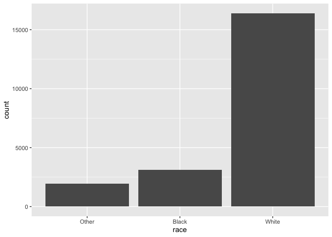<!-- -->

## Practice

1. What levels does the `rincome` variable have?  Make a barplot showing the distribution of this variable.  Is it easy to interpret this barplot?


2. What is the most common level of `relig` in this survey? What’s the most common level of `partyid`?


3. Which `relig` does `denom` (denomination) apply to? How can you find out with a table? How can you find out with a visualisation?


# Changing factor order

It can be helpful to change the order of factor levels for a visualization or a table.

Consider the relationship between the average number of hours spent watching TV per day and religion.  We can calculate an average hour spent watching TV (and average age) using `group_by()` and then `summarize()`:

``` r
relig_summary <- gss_cat %>%
  group_by(relig) %>%
  summarize(
    mean_age = mean(age, na.rm = TRUE),
    mean_tv = mean(tvhours, na.rm = TRUE),
    n = n()
  )

relig_summary
```

```
## # A tibble: 15 × 4
##    relig                   mean_age mean_tv     n
##    <fct>                      <dbl>   <dbl> <int>
##  1 No answer                   49.5    2.72    93
##  2 Don't know                  35.9    4.62    15
##  3 Inter-nondenominational     40.0    2.87   109
##  4 Native american             38.9    3.46    23
##  5 Christian                   40.1    2.79   689
##  6 Orthodox-christian          50.4    2.42    95
##  7 Moslem/islam                37.6    2.44   104
##  8 Other eastern               45.9    1.67    32
##  9 Hinduism                    37.7    1.89    71
## 10 Buddhism                    44.7    2.38   147
## 11 Other                       41.0    2.73   224
## 12 None                        41.2    2.71  3523
## 13 Jewish                      52.4    2.52   388
## 14 Catholic                    46.9    2.96  5124
## 15 Protestant                  49.9    3.15 10846
```

Then we can plot the average TV hours by religion:

``` r
relig_summary %>%
  ggplot(mapping = aes(x = mean_tv, y = relig)) + 
  geom_point()
```

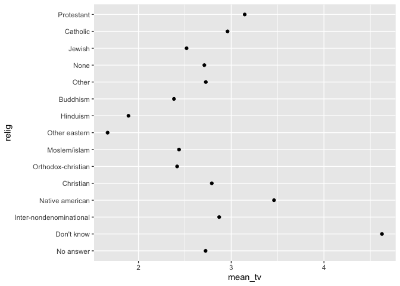<!-- -->

We can make this plot easier to read by ordering the levels of `relig` by their mean hours of tv.  We can do this with the `fct_reorder()` function, which takes a factor (the first argument) and reorders it by another variable (the second argument):

``` r
relig_summary %>%
  ggplot(mapping = aes(x = mean_tv, y = fct_reorder(relig, mean_tv))) + 
  geom_point()
```

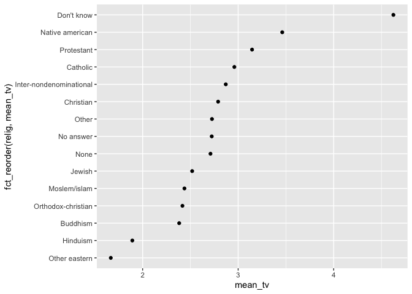<!-- -->

Ordering the plot in this way makes it easy to see which religious groups have the highest average TV hours and which ones have the lowest.

A clearer way to write this code would be the following.  Why?  Because it take the re-ordering of the `relig` categories outside of the plotting functions.  It's good practice to transform and re-order your variables *before* making your plots!

``` r
relig_summary %>%
  mutate(relig = fct_reorder(relig, mean_tv)) %>%
  ggplot(mapping = aes(x = mean_tv, y = relig)) + 
  geom_point()
```

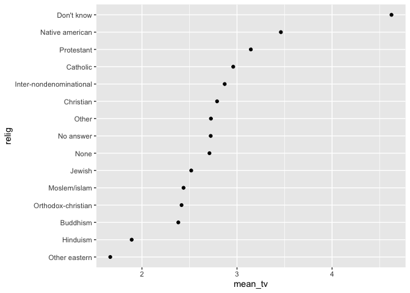<!-- -->

Here's a similar ordered plot where we look at the relationship between the levels of `rincome` and mean hours of tv:

``` r
rincome_summary <- gss_cat %>%
  group_by(rincome) %>%
  summarise(
    mean_age = mean(age, na.rm = TRUE),
    mean_tv = mean(tvhours, na.rm = TRUE),
    n = n()
  )

rincome_summary %>%
  mutate(rincome = fct_reorder(rincome, mean_tv)) %>%
  ggplot(mapping = aes(x = mean_tv, y = rincome)) + 
  geom_point()
```

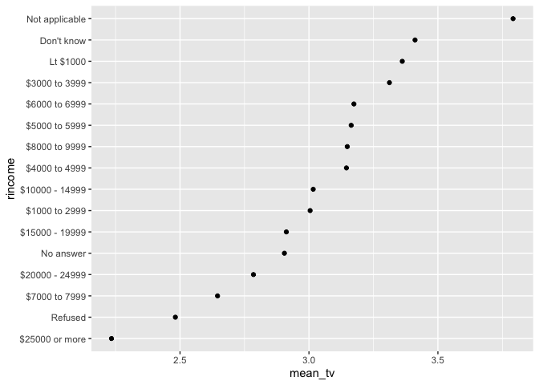<!-- -->

Does it make it more interpretable to order the income levels by TV usage?  Here the income values have a natural ordering to them already, so it's not helpful to re-order them by a second variable.  If we don't re-order them, what do we get?

``` r
rincome_summary %>%
  ggplot(mapping = aes(x = mean_tv, y = rincome)) + 
  geom_point()
```

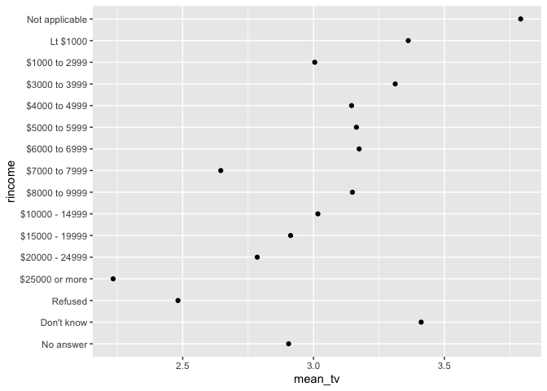<!-- -->

Instead, for income, we might want to re-order the levels to put `Not applicable` at the end with the other special levels.  We can do this with the `fct_relevel()` function, which takes a factor (the first argument) and moves the variables in the remaining arguments to the front of the line of levels:

``` r
rincome_summary %>%
  mutate(rincome = fct_relevel(rincome, "Not applicable")) %>%
  ggplot(mapping = aes(x = mean_tv, y = rincome)) + 
  geom_point()
```

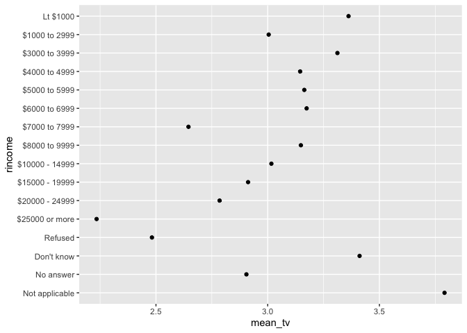<!-- -->

If we wanted to rearrange all of those special levels, we could do:

``` r
rincome_summary %>%
  mutate(rincome = fct_relevel(rincome, "Refused", "No answer", "Don't know", "Not applicable")) %>%
  ggplot(mapping = aes(x = mean_tv, y = rincome)) + 
  geom_point()
```

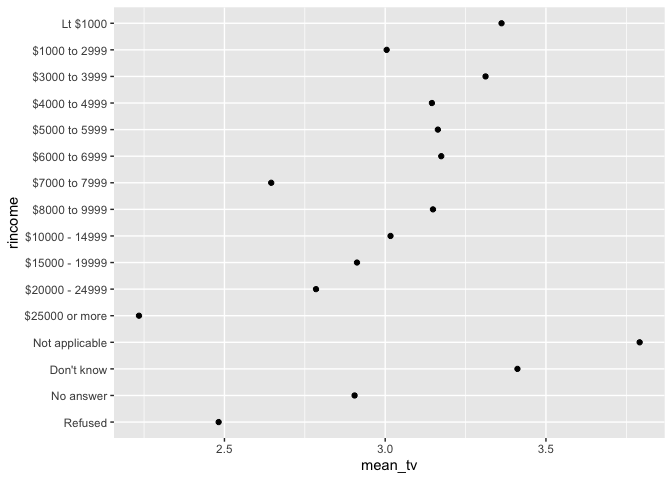<!-- -->

In these last two plots, we can see a general trend that individuals with lower incomes tend to watch more TV, on average.  However, this trend isn't perfect, since the  `mean_tv` ordering is not exactly the same as the `rincome` ordering.

Here are a couple of other ways to re-order the levels of your factor variable that are specific to making nicer graphics:

(1) For plots with colored lines, we can use `fct_reorder2()` to reorder the factor levels by the `y` values associated with the largest `x` values (the values at the far right of the plot).  This makes the colors of the lines match the same order as the colors of the legend. 

**BEFORE:**

``` r
by_age <- gss_cat %>%
  filter(!is.na(age)) %>%
  count(age, marital) %>%
  group_by(age) %>%
  mutate(prop = n / sum(n))

by_age %>%
  ggplot(mapping = aes(x = age, y = prop, color = marital)) +
  geom_line(na.rm = TRUE)
```

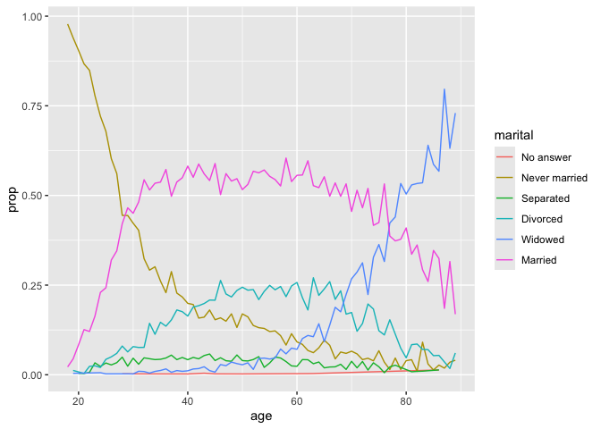<!-- -->

**AFTER:**

``` r
by_age %>%
ggplot(mapping = aes(x = age, y = prop, color = fct_reorder2(marital, age, prop))) +
  geom_line()
```

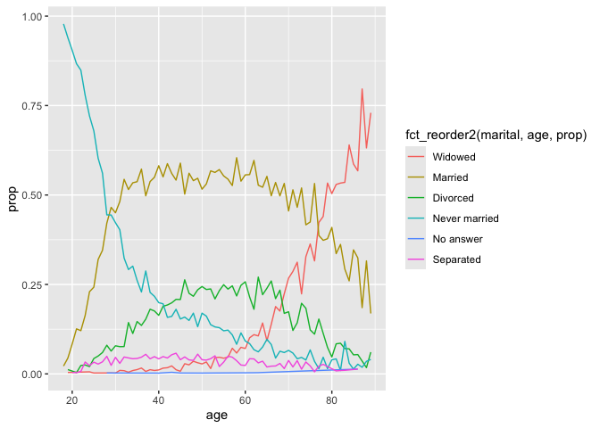<!-- -->

**And we can also fix the label for the legend to be nicer:**

``` r
by_age %>%
ggplot(mapping = aes(x = age, y = prop, color = fct_reorder2(marital, age, prop))) +
  geom_line() + 
  labs(color = "Marital status")
```

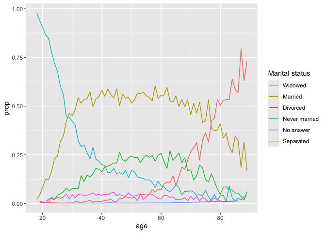<!-- -->

(2) For bar plots, we can use `fct_infreq()` to order the factor levels in increasing frequency.  We can then use `fct_rev()` to reverse the order of the factor levels:

**BEFORE:**

``` r
gss_cat %>%
  ggplot(mapping = aes(x = marital)) +
    geom_bar()
```

<!-- -->

**AFTER:**

``` r
gss_cat %>%
  mutate(marital = fct_infreq(marital)) %>%
  ggplot(aes(marital)) +
    geom_bar()
```

<!-- -->

**IN REVERSE:**

``` r
gss_cat %>%
  mutate(marital = fct_rev(fct_infreq(marital))) %>%
  ggplot(aes(marital)) +
    geom_bar()
```

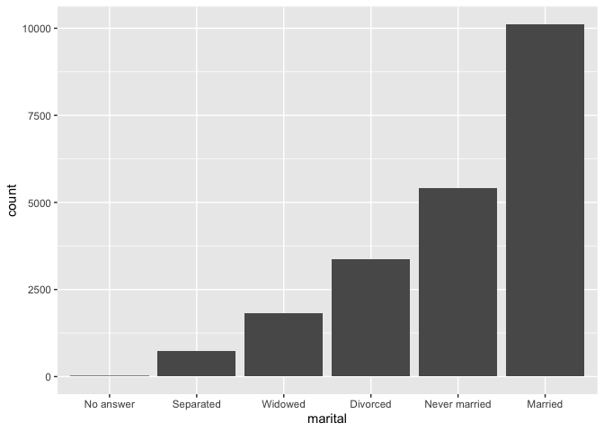<!-- -->


## Practice

(1) Look at the levels for each factor variable in the `gss_cat` data set.  For each of these factor variables, are the order of the levels arbitrary or meaningful?

``` r
gss_cat
```

```
## # A tibble: 21,483 × 9
##     year marital         age race  rincome        partyid    relig denom tvhours
##    <int> <fct>         <int> <fct> <fct>          <fct>      <fct> <fct>   <int>
##  1  2000 Never married    26 White $8000 to 9999  Ind,near … Prot… Sout…      12
##  2  2000 Divorced         48 White $8000 to 9999  Not str r… Prot… Bapt…      NA
##  3  2000 Widowed          67 White Not applicable Independe… Prot… No d…       2
##  4  2000 Never married    39 White Not applicable Ind,near … Orth… Not …       4
##  5  2000 Divorced         25 White Not applicable Not str d… None  Not …       1
##  6  2000 Married          25 White $20000 - 24999 Strong de… Prot… Sout…      NA
##  7  2000 Never married    36 White $25000 or more Not str r… Chri… Not …       3
##  8  2000 Divorced         44 White $7000 to 7999  Ind,near … Prot… Luth…      NA
##  9  2000 Married          44 White $25000 or more Not str d… Prot… Other       0
## 10  2000 Married          47 White $25000 or more Strong re… Prot… Sout…       3
## # ℹ 21,473 more rows
```

``` r
levels(gss_cat$marital)
```

```
## [1] "No answer"     "Never married" "Separated"     "Divorced"     
## [5] "Widowed"       "Married"
```

``` r
levels(gss_cat$race)
```

```
## [1] "Other"          "Black"          "White"          "Not applicable"
```

``` r
levels(gss_cat$rincome)
```

```
##  [1] "No answer"      "Don't know"     "Refused"        "$25000 or more"
##  [5] "$20000 - 24999" "$15000 - 19999" "$10000 - 14999" "$8000 to 9999" 
##  [9] "$7000 to 7999"  "$6000 to 6999"  "$5000 to 5999"  "$4000 to 4999" 
## [13] "$3000 to 3999"  "$1000 to 2999"  "Lt $1000"       "Not applicable"
```

``` r
levels(gss_cat$partyid)
```

```
##  [1] "No answer"          "Don't know"         "Other party"       
##  [4] "Strong republican"  "Not str republican" "Ind,near rep"      
##  [7] "Independent"        "Ind,near dem"       "Not str democrat"  
## [10] "Strong democrat"
```

``` r
levels(gss_cat$relig)
```

```
##  [1] "No answer"               "Don't know"             
##  [3] "Inter-nondenominational" "Native american"        
##  [5] "Christian"               "Orthodox-christian"     
##  [7] "Moslem/islam"            "Other eastern"          
##  [9] "Hinduism"                "Buddhism"               
## [11] "Other"                   "None"                   
## [13] "Jewish"                  "Catholic"               
## [15] "Protestant"              "Not applicable"
```

``` r
levels(gss_cat$denom)
```

```
##  [1] "No answer"            "Don't know"           "No denomination"     
##  [4] "Other"                "Episcopal"            "Presbyterian-dk wh"  
##  [7] "Presbyterian, merged" "Other presbyterian"   "United pres ch in us"
## [10] "Presbyterian c in us" "Lutheran-dk which"    "Evangelical luth"    
## [13] "Other lutheran"       "Wi evan luth synod"   "Lutheran-mo synod"   
## [16] "Luth ch in america"   "Am lutheran"          "Methodist-dk which"  
## [19] "Other methodist"      "United methodist"     "Afr meth ep zion"    
## [22] "Afr meth episcopal"   "Baptist-dk which"     "Other baptists"      
## [25] "Southern baptist"     "Nat bapt conv usa"    "Nat bapt conv of am" 
## [28] "Am bapt ch in usa"    "Am baptist asso"      "Not applicable"
```

(2) Why did moving “Not applicable” to the front of the levels in our income/tv plot move it to the bottom of the plot?

``` r
rincome_summary <- gss_cat %>%
  group_by(rincome) %>%
  summarise(
    mean_age = mean(age, na.rm = TRUE),
    mean_tv = mean(tvhours, na.rm = TRUE),
    n = n()
  )

rincome_summary %>%
  ggplot(mapping=aes(x=mean_tv, y=rincome)) + 
  geom_point()
```

<!-- -->

``` r
rincome_summary %>%
  mutate(rincome = fct_relevel(rincome, "Not applicable")) %>%
  ggplot(mapping=aes(x=mean_tv, y=rincome)) + 
  geom_point()
```

<!-- -->

# Modifying factor levels

Being able to change the values of the factor levels themselves is more useful than just changing the order of the levels.  The main tool to do this in the `forcats` packages is the `fct_recode()` function.

Suppose, for example, we wanted to change the levels of the `partyid` variable in the `gss_cat` data set:

``` r
gss_cat %>% count(partyid)
```

```
## # A tibble: 10 × 2
##    partyid                n
##    <fct>              <int>
##  1 No answer            154
##  2 Don't know             1
##  3 Other party          393
##  4 Strong republican   2314
##  5 Not str republican  3032
##  6 Ind,near rep        1791
##  7 Independent         4119
##  8 Ind,near dem        2499
##  9 Not str democrat    3690
## 10 Strong democrat     3490
```

We might want to change the levels to put political party first (Republican, Democrat, Independent) to make it easier to compare the levels to each other:

``` r
gss_cat %>%
  mutate(partyid = fct_recode(partyid,
    "Republican, strong"    = "Strong republican",
    "Republican, weak"      = "Not str republican",
    "Independent, near rep" = "Ind,near rep",
    "Independent, near dem" = "Ind,near dem",
    "Democrat, weak"        = "Not str democrat",
    "Democrat, strong"      = "Strong democrat"
  )) %>%
  count(partyid)
```

```
## # A tibble: 10 × 2
##    partyid                   n
##    <fct>                 <int>
##  1 No answer               154
##  2 Don't know                1
##  3 Other party             393
##  4 Republican, strong     2314
##  5 Republican, weak       3032
##  6 Independent, near rep  1791
##  7 Independent            4119
##  8 Independent, near dem  2499
##  9 Democrat, weak         3690
## 10 Democrat, strong       3490
```

See here that the first argument to the `fct_recode()` function is the variable we want to recode.  The remaining arguments give the changes we want to the levels, in the format of `new level name` = `old level name`. Any old level names that we don't include in our changes will remain the same, as is the case for `Indpendent`, `No answer`, `Don't know`, and `Other party` in this example.

We can also use this function to combine groups by assigning the same `new level name` to multiple old level names.  (Remember to only combine levels that it makes sense to combine!)

``` r
gss_cat %>%
  mutate(partyid = fct_recode(partyid,
    "Republican, strong"    = "Strong republican",
    "Republican, weak"      = "Not str republican",
    "Independent, near rep" = "Ind,near rep",
    "Independent, near dem" = "Ind,near dem",
    "Democrat, weak"        = "Not str democrat",
    "Democrat, strong"      = "Strong democrat",
    "Other"                 = "No answer",
    "Other"                 = "Don't know",
    "Other"                 = "Other party"
  )) %>%
  count(partyid)
```

```
## # A tibble: 8 × 2
##   partyid                   n
##   <fct>                 <int>
## 1 Other                   548
## 2 Republican, strong     2314
## 3 Republican, weak       3032
## 4 Independent, near rep  1791
## 5 Independent            4119
## 6 Independent, near dem  2499
## 7 Democrat, weak         3690
## 8 Democrat, strong       3490
```

If we need to collapse a lot of levels, we can use the `fct_collapse()` function instead of `fct_recode()` by providing a list of the old levels we want to combine into a new level:

``` r
gss_cat %>%
  mutate(partyid = fct_collapse(partyid,
    Other = c("No answer", "Don't know", "Other party"),
    Republican = c("Strong republican", "Not str republican"),
    Independent = c("Ind,near rep", "Independent", "Ind,near dem"),
    Democrat = c("Not str democrat", "Strong democrat")
  )) %>%
  count(partyid)
```

```
## # A tibble: 4 × 2
##   partyid         n
##   <fct>       <int>
## 1 Other         548
## 2 Republican   5346
## 3 Independent  8409
## 4 Democrat     7180
```

And if we want to lump all the smaller categories together into an "Other" group, we can use `fct_lump()` to do this, specifying that we want to keep the `n` largest categories distinct but putting the rest in an "Other" category:

``` r
gss_cat %>%
  mutate(relig_lumped = fct_lump(relig, n = 10)) %>%
  count(relig_lumped)
```

```
## # A tibble: 10 × 2
##    relig_lumped                n
##    <fct>                   <int>
##  1 Inter-nondenominational   109
##  2 Christian                 689
##  3 Orthodox-christian         95
##  4 Moslem/islam              104
##  5 Buddhism                  147
##  6 None                     3523
##  7 Jewish                    388
##  8 Catholic                 5124
##  9 Protestant              10846
## 10 Other                     458
```

``` r
gss_cat %>%
  mutate(relig_lumped = fct_lump(relig, n = 5)) %>%
  count(relig_lumped)
```

```
## # A tibble: 6 × 2
##   relig_lumped     n
##   <fct>        <int>
## 1 Christian      689
## 2 None          3523
## 3 Jewish         388
## 4 Catholic      5124
## 5 Protestant   10846
## 6 Other          913
```

Again, we should always be careful when we combine categories together.  Using `fct_lump()` is a tool for making tables and plots simpler by having a smaller number of categories, but the resulting "Other" category has lost information about the individual categories that have been lumped together!

## Practice

(1) How might you collapse `rincome` into a small set of categories?  Does it make sense to use `fct_lump()` or is it better to use `fct_collapse()`?

``` r
gss_cat %>%
  count(rincome)
```

```
## # A tibble: 16 × 2
##    rincome            n
##    <fct>          <int>
##  1 No answer        183
##  2 Don't know       267
##  3 Refused          975
##  4 $25000 or more  7363
##  5 $20000 - 24999  1283
##  6 $15000 - 19999  1048
##  7 $10000 - 14999  1168
##  8 $8000 to 9999    340
##  9 $7000 to 7999    188
## 10 $6000 to 6999    215
## 11 $5000 to 5999    227
## 12 $4000 to 4999    226
## 13 $3000 to 3999    276
## 14 $1000 to 2999    395
## 15 Lt $1000         286
## 16 Not applicable  7043
```

# Re-coding with the NMES data set

For your Assignment #3, you will read in a raw version of the NMES dataset and re-code it to match a provided codebook.  We will work through a couple of the variables here as examples.  

First, read in the raw NMES data:

``` r
nmesRAW <- read_csv("data/nmesUNPROC.csv")
```

```
## Rows: 4078 Columns: 16
## ── Column specification ────────────────────────────────────────────────────────
## Delimiter: ","
## dbl (16): id, totalexp, lc5, chd5, eversmk, current, former, packyears, year...
## 
## ℹ Use `spec()` to retrieve the full column specification for this data.
## ℹ Specify the column types or set `show_col_types = FALSE` to quiet this message.
```

``` r
nmesRAW
```

```
## # A tibble: 4,078 × 16
##       id totalexp   lc5  chd5 eversmk current former packyears yearsince   bmi
##    <dbl>    <dbl> <dbl> <dbl>   <dbl>   <dbl>  <dbl>     <dbl>     <dbl> <dbl>
##  1 20449  25952.      1     0       0      NA      0     0             0  24.0
##  2 15534    378.      0     0       1       1      0     3             0  26.7
##  3  9503     51.2     0     0       1       0      1    40             9  22.3
##  4 15024   1899.      0     0       0      NA      0     0             0  25.1
##  5 17817    154.      0     0       1       1      0    86             0  20.2
##  6 31716    270       0     0       0      NA      0     0             0  22.2
##  7   679    142       0     0       0      NA      0     0             0  24.4
##  8 32819    898.      0     0       1       0      1     0.900        32  24.1
##  9 33173    346       0     0       0      NA      0     0             0  17.5
## 10 38247   2543.      0     0       0      NA      0     0             0  25.4
## # ℹ 4,068 more rows
## # ℹ 6 more variables: beltuse <dbl>, educate <dbl>, marital <dbl>, poor <dbl>,
## #   age <dbl>, female <dbl>
```

Notice that each variable in this dataset is of type `double`.  This is because all values in this dataset are saved in a numeric format.  However, for many of these variables the numbers really represent categories!  For example, for the `eversmk` variable, the `0` represents a never smoker and the `1` represents a never smoker.  So this variable would be better represented as a factor variable.

We can convert this variable in the following way:

(1) First, convert this variable to a factor using the `factor()` function. The look to see what the original level values are.  It can be helpful to check that the `factor()` function preserved the original values by counting by both the old and new versions of the variable.

``` r
nmesRAW <- nmesRAW %>%
  mutate(eversmk_recode = factor(eversmk))

nmesRAW %>%
  count(eversmk, eversmk_recode)
```

```
## # A tibble: 2 × 3
##   eversmk eversmk_recode     n
##     <dbl> <fct>          <int>
## 1       0 0               2084
## 2       1 1               1994
```

(2) Refer to the codebook to see what these values actually mean; that is, what category (factor level) does each value represent.  Here we would be told that `0` represents a never smoker and the `1` represents a never smoker.

(3) Next recode the factor levels using `fct_recode()` and check the new labels with the old:

``` r
nmesRAW <- nmesRAW %>%
  mutate(eversmk_recode = fct_recode(eversmk_recode,
                                     "Never smoker" = "0",
                                     "Ever smoker" = "1"
                                     ))

nmesRAW %>%
  count(eversmk, eversmk_recode)
```

```
## # A tibble: 2 × 3
##   eversmk eversmk_recode     n
##     <dbl> <fct>          <int>
## 1       0 Never smoker    2084
## 2       1 Ever smoker     1994
```

(4) Finally, once you are happy with your recoding, you can over-write your original variable with the recoded one and remove the recoded one!

``` r
nmesRAW <- nmesRAW %>%
  mutate(eversmk = eversmk_recode) %>%
  select(-eversmk_recode)

nmesRAW
```

```
## # A tibble: 4,078 × 16
##       id totalexp   lc5  chd5 eversmk   current former packyears yearsince   bmi
##    <dbl>    <dbl> <dbl> <dbl> <fct>       <dbl>  <dbl>     <dbl>     <dbl> <dbl>
##  1 20449  25952.      1     0 Never sm…      NA      0     0             0  24.0
##  2 15534    378.      0     0 Ever smo…       1      0     3             0  26.7
##  3  9503     51.2     0     0 Ever smo…       0      1    40             9  22.3
##  4 15024   1899.      0     0 Never sm…      NA      0     0             0  25.1
##  5 17817    154.      0     0 Ever smo…       1      0    86             0  20.2
##  6 31716    270       0     0 Never sm…      NA      0     0             0  22.2
##  7   679    142       0     0 Never sm…      NA      0     0             0  24.4
##  8 32819    898.      0     0 Ever smo…       0      1     0.900        32  24.1
##  9 33173    346       0     0 Never sm…      NA      0     0             0  17.5
## 10 38247   2543.      0     0 Never sm…      NA      0     0             0  25.4
## # ℹ 4,068 more rows
## # ℹ 6 more variables: beltuse <dbl>, educate <dbl>, marital <dbl>, poor <dbl>,
## #   age <dbl>, female <dbl>
```

Eventually, you may become confident enough in your coding to simply recode the original variable right away, without checking the new values with the old ones, as below.  However, when you're starting it can be useful to check your recoding as you go, so you are sure you are re-coding the way you think you are re-coding!

``` r
nmesRAW <- read_csv("data/nmesUNPROC.csv")
```

```
## Rows: 4078 Columns: 16
## ── Column specification ────────────────────────────────────────────────────────
## Delimiter: ","
## dbl (16): id, totalexp, lc5, chd5, eversmk, current, former, packyears, year...
## 
## ℹ Use `spec()` to retrieve the full column specification for this data.
## ℹ Specify the column types or set `show_col_types = FALSE` to quiet this message.
```

``` r
nmesRAW <- nmesRAW %>%
  mutate(eversmk = fct_recode(factor(eversmk),
                              "Never smoker" = "0",
                              "Ever smoker" = "1"
                              ))

nmesRAW
```

```
## # A tibble: 4,078 × 16
##       id totalexp   lc5  chd5 eversmk   current former packyears yearsince   bmi
##    <dbl>    <dbl> <dbl> <dbl> <fct>       <dbl>  <dbl>     <dbl>     <dbl> <dbl>
##  1 20449  25952.      1     0 Never sm…      NA      0     0             0  24.0
##  2 15534    378.      0     0 Ever smo…       1      0     3             0  26.7
##  3  9503     51.2     0     0 Ever smo…       0      1    40             9  22.3
##  4 15024   1899.      0     0 Never sm…      NA      0     0             0  25.1
##  5 17817    154.      0     0 Ever smo…       1      0    86             0  20.2
##  6 31716    270       0     0 Never sm…      NA      0     0             0  22.2
##  7   679    142       0     0 Never sm…      NA      0     0             0  24.4
##  8 32819    898.      0     0 Ever smo…       0      1     0.900        32  24.1
##  9 33173    346       0     0 Never sm…      NA      0     0             0  17.5
## 10 38247   2543.      0     0 Never sm…      NA      0     0             0  25.4
## # ℹ 4,068 more rows
## # ℹ 6 more variables: beltuse <dbl>, educate <dbl>, marital <dbl>, poor <dbl>,
## #   age <dbl>, female <dbl>
```

## Practice

(1) Recode the `beltuse` variable to a factor variable according to the following codebook:

     * ` beltuse`: 1 = Rarely, 2 = Sometimes, 3 = Always/Almost always


(2) Create a new factor variable named `beltAlways` that has two levels: `Always` which includes the "Always/Almost always" levels and `Not Always` which has the other 2 levels.


(3) This raw dataset doesn't contain an `MSCD` variable.  We can create one from the `lc5` and `chd5` variables.  The codebook for these two variables is given below.  Create an `MSCD` variable as a factor variable with the levels `No MSCD` and `MSCD`.

     * `lc5`: 1 = Lung Cancer, Laryngeal Cancer or COPD, 0 = None of these
     * `chd5`: 1 = CHD, Stroke, and other cancers (oral, esophageal, stomach, kidney and bladder), 0 = None of these


