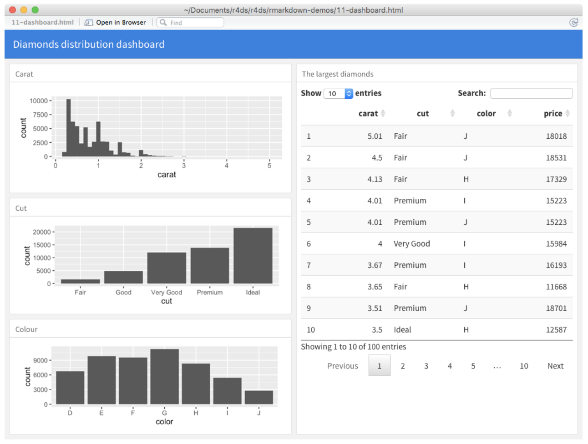
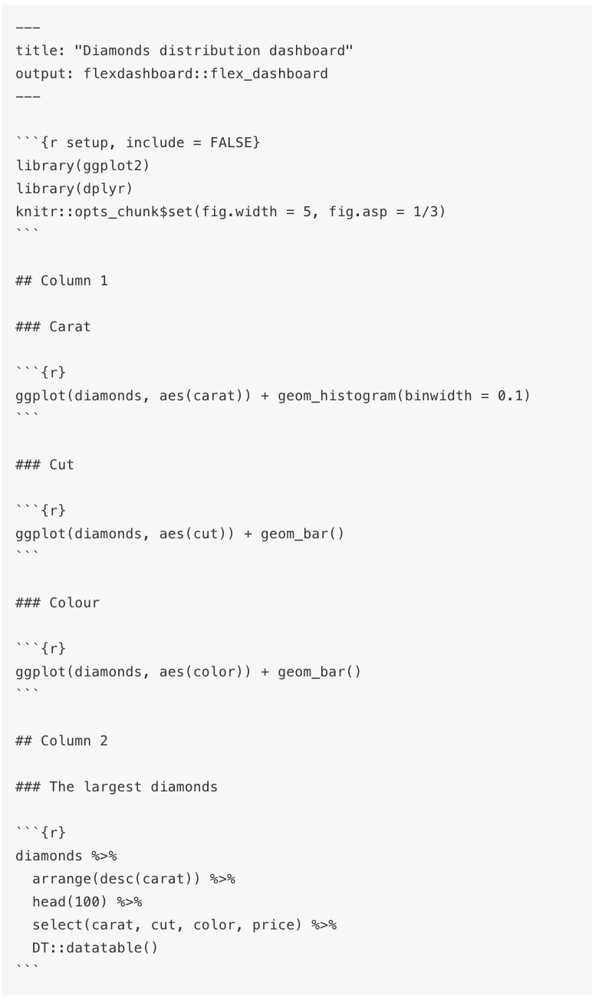

In Module 5, we are learning more about using R Markdown to create data analysis reports.  Another way to use R Markdown to share your work is to create a dashboard using Flex dashboard.  Some of the material from today's class is adapted from "R for Data Science" by Grolemund and Wickham, sections [29.6](https://r4ds.had.co.nz/r-markdown-formats.html#dashboards) and [29.7.2](https://r4ds.had.co.nz/r-markdown-formats.html#shiny). You can find lots of other R Markdown formats, like presentations and websites in Chapter 29 of this books as well!

Dashboards allow you to communicate large amounts of information visually and quickly with the added benefit of allowing the user to interact with the data directly in the dashboard. **Flex dashboard** is a method of creating dashboards using R Markdown.  

Here's an example of what a dashboard might look like:


You can find more information about creating dashboards [here](https://rmarkdown.rstudio.com/flexdashboard/).  We will look at a couple of example dashboards together, but refer to this link if you want more information on creating your own!

# Getting started

First we need to install the `flexdashboard` package to be able to create these dashboards.  Remember you will only need to install this package once!  So run this command and then comment out the line of code so you won't run it again!

``` r
install.packages("flexdashboard")
```

To create a new dashboard, use the menus at the top of RStudio cloud to select **File** --> **New File** --> **R Markdown...**  Choose **From Template** in the box on the left and then select **Flex Dashboard** from the box on the right.  Then click **OK**.  This will open up a dashboard template.  

You can knit this file just as you would a regular R Markdown document.  Let's do that and take a look at what you get!  Note you will have to save this file first before knitting.  Save it in your project directory as `trial_dashboard.Rmd` when prompted.

# Layouts

Notice the layout of the blank document is given by the hash (#) signs.  In general:

* Each level 1 header (#) begins a *new page* in the dashboard.
* Each level 2 header (##) begins a *new column*.
* Each level 3 header (###) begins a *new row*.

More recent dashboards also designate columns using the following syntax:

```
Column {data-width=650}
-----------------------------------------------------------------------
```

When you knit the blank document, you'll see blank output with a title (**Untitled**) and then three rows of charts (**Chart A**, **Chart B**, and **Chart C**.  Notice that in the code there are three sections with these titles, each designated with three hashes (###)).  Right now these charts are all blank, since these sections just have empty code chunks!

The code below produces the dashboard example at the beginning of this document.  


Here you can see there are two columns (designated by ##) and various rows within each column (designated with ###).  You can also find this code in the file `Diamond_dashboard_example.Rmd` in this project. To run the code, though, we need to install the `DT` package that provides a nice way to display data on an HTML website.  Install this package using the code below, then comment it out so you won't reinstall the package.

``` r
install.packages("DT")
```

Now open the file Diamond_dashboard_example.Rmd` and knit it!  Be sure to open the resulting dashboard in a browser window to really see it; you won't be able to view it very well in the small viewer pane within RStudio.

Feel free to play with the code in this diamond dashboard to see how things change when you knit it.  For example, can you change the titles of each of the graphs in the column on the left?  How could you change the first graph on the left to be a histogram of prices instead of carats?  Or could you add a fourth graph to the dashboard that shows price?  Note that to get access to the `diamonds` dataset that the dashboard uses, you will have to have loaded the `ggplot2` package, which is part of the `tidyverse`.  You can see that the dashboard uses this package by looking at the first set-up code chunk in the dashboard .Rmd file.

# Shiny

Adding the `shiny` package when creating your flex dashboard allows you to let your users change underlying parameters and see the results immediately on the dashboard without needing to re-knit the document.  Basically, using Shiny with flex dashboard turns a static R Markdown report into an Interactive Document. It’s important to note that interactive documents need to be deployed to a Shiny Server to be shared broadly (see instructions for creating a free account at http://www.shinyapps.io/ and instructions on how to publish to the web at the end of this document.).

To work with `shiny`, you need to first install it.  (Remember to comment this out after installation!)

``` r
install.packages("shiny")
```

Then you add the option `runtime: shiny` to the YAML header of your flex dashboard .Rmd file.  Once you've done this, you can use the “input” functions to add interactive components to the document.  You can have input that is text, numeric, selecting from a menu, or checking a box, as shown below.  (Don't run this code, it's just there to show you what the syntax looks like!)


``` r
textInput("name", "What is your name?")
numericInput("age", "How old are you?", NA, min = 0, max = 150)
selectInput("variable", "Variable:",
                  c("Cylinders (cyl)" = "cyl",
                    "Transmission (am)" = "am",
                    "Gears (gear)" = "gear"))
checkboxInput("outliers", "Show outliers", TRUE)
```

The input values are stored in the object given by the first argument of these input functions.  So the text input is stored in an object called `name` and the numeric input is stored in an object called `age`.  You can then refer to the values with `input$name` and `input$age`, and the code that uses them will be automatically re-run whenever they change.

The second argument gives the text that is displayed to the user to prompt their input.  So the input area for name will show "What is your name?" and so on.  Later arguments for each type give additional information about that input, such as minimum and maximum allowed values for numeric input and menu options for the select input.  We will see this in the examples we will look at below.

To add Shiny components to a flex dashboard you must do the following:

* Add `runtime: shiny` to the YAML header at the top of the document.
* Add the `{.sidebar}` attribute to the first column of the dashboard to make it a host for Shiny input controls (note this step isn’t strictly required, but many Shiny based dashboards will want to do this).
* Add Shiny inputs and outputs as appropriate using the input functions.
* When including plots, be sure to wrap them in a call to `renderPlot`. This is important not only for dynamically responding to changes but also to ensure that they are automatically re-sized when their container changes.

# Shiny examples

There are a couple examples of simple flex dashboards that use Shiny in the following files that are included with this project.  Open each one of these files and run it by clicking the "Run document" button that is where the "Knit" button usually is.  Shiny apps must be run rather than knitted, but the idea is the same!  Be sure to open the output in a browser tab.  

* `GeyserFlexDashboard.Rmd`
* `MPGFlexDashboard.Rmd`

Play with the user input options in the left hand sidebar to see how the user can interact with the data through the dashboard.  Then look at both the code and the output to see how the code relates to what is shown in the dashboard.  Play around with the options in the code chunks to be sure you understand what they do!  

One thing to point out in the `MPGFlexDashboard.Rmd` file is the following chunk of code:

``` r
formulaText <- reactive({
    paste("mpg ~", input$variable)
  })
```

This chunk of code allows the title of the graph to change depending on the input given by the user.  It uses the `reactive()` function to specify that the text is not static but will change depending on what is selected by the user.  You can see here the object `formulaText` will contain text consisting of pasting togther "mpg ~" and the variable value selected from the user in the drop-down menu.  Then this `formulaText` object is used as the title in the plot!

# Many other examples!

You can find lots and lots and lots of examples of more complicated flex dashboards (most of which use Shiny) [here](https://pkgs.rstudio.com/flexdashboard/articles/examples.html).  For each of these examples, you can click on the "</> Source Code" button in the upper right to see the R code that was used to create the dashboard.  If you pasted this code into a blank R Markdown document, you would be able to recreate the dashboard!

# Practice

Starting with the `MPGFlexDashboard.Rmd` file, create a dashboard that allows users to explore the NMES dataset by seeing how total medical expenditures relate to other variables in the dataset.  We could also think about adding a checkbox option to allow the user to specify log10 medical expenditures instead!

# Other Resources

Below are instructions for getting a free `Shinyapps.io` account and then publishing your flex dashboard to the web:

1. Sign up for a free account on [http://www.shinyapps.io/](http://www.shinyapps.io/)
2. Within RStudio or Posit Cloud, install the rsconnect package: `install.packages("rsconnect")`
3. Within Posit Cloud, select "Tools" then "Global Options..." and then select "Publishing" from the left-hard menu.  (Within the non-cloud RStudio, under the "Preferences" menu, click on "Publishing".)  Click the "Connect" button next to the publishing accounts box and then "Shinypps.io" to link your shinyapps.io account to your RStudio.  Click on "Shinyapps.io" from the pop-up menu, and then follow the instructions to link your account. This involves copying and pasting a token from your account into the box in R Studio.
4. Now you are ready to publish!  Click the "Run Document" button to create your app; then click "Publish" in the upper right hand corner of your app (the publish icon is a blue circle with blue curves around it). Choose "Publish just this document" from the pop-up menu.  Make sure the selected destination account is your shinyapps.io account.  You can change the name of the app if you want.  Then click publish!
5. If you want to delete the app (unpublish it), you need to do this from within your shinyapps.io account.  Go to [http://www.shinyapps.io/](http://www.shinyapps.io/) and log in to your account.  Click on applications to manage your applications.  You must first archive your app before you can delete it.

Here are a list of resources on Shiny (more involved than Flex Dashboard):

* Main page: http://shiny.rstudio.com
* Awesome tutorial: http://shiny.rstudio.com/tutorial/
* Very cool illustrations of statistical concepts (especially useful for our class are Multiple Regression Visualization and Sampling Distributions of Various Statistics): http://statistics.calpoly.edu/shiny
* An example app that Ruthe (one of our former TAs) made in a class: https://gunben.shinyapps.io/Pneumonia426/


