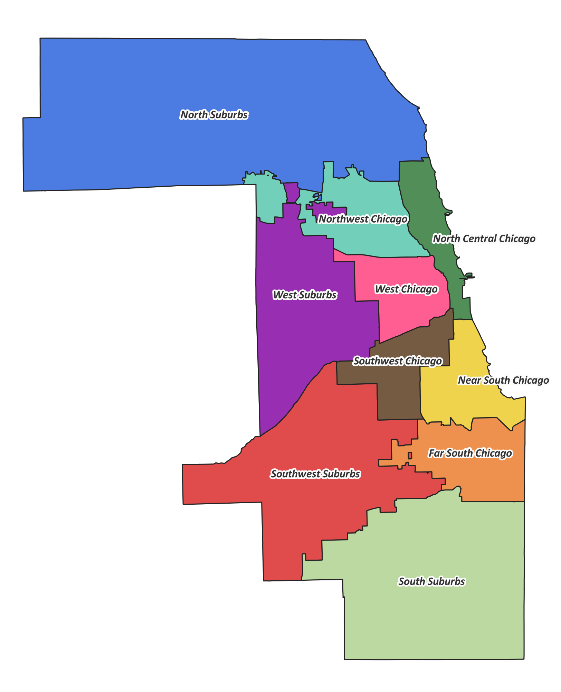
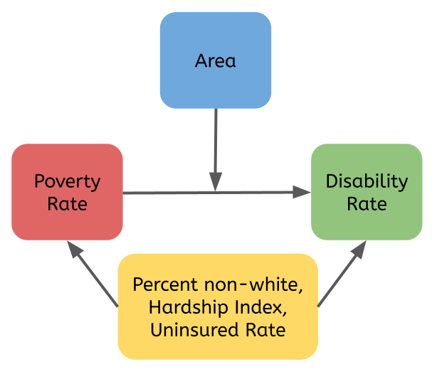

```{r setup, include=FALSE}
knitr::opts_chunk$set(echo = FALSE, message = FALSE)
```

```{r libraries, include=FALSE}
library(tidyverse)
library(RColorBrewer)
library(tidyr)
library(haven)
library(broom)
library(survey)
library(ggpubr)
library(ggrepel)
library(kableExtra)
library(plotrix)
library(knitr)
library(MASS)
library(dplyr)
library(patchwork)
library(ggthemes)
library(jtools)
library(readxl)
library(stringr)

```

## Data and Question of Interest

  Cook County, Illinois is the second largest county in the United States and is home to the City of Chicago. The duty to collect public health data in Cook County is split between the Chicago Department of Public Health, which collects data in the city, and the Cook County Department of Public Health, which reports on the surrounding suburbs in the county. Both Departments release [Health](https://chicagohealthatlas.org/){target="_blank"} [Atlases](https://cookcountyhealthatlas.org/){target="_blank"}, containing area-level data on a multitude of public health interests and demographics. These atlases are databases that combine statistics from federal, state, and local collections.

  The data used from the Health Atlases are at the census tract level. Cook County has 1,331 census tracts, used by the United States Census to analyze population trends in small, geographically-static areas. The tracts range in population from 347 to 20,087.

Below, data from both Health Atlases are analyzed to answer the following questions:

* How is the poverty rate of a census tract related to its disability rate?
* How does the area of Cook County in which a tract is situated modify the relationship between poverty and disability rates?


```{r data, include=FALSE}

options(digits=20)

chicago <- read_csv("data/chicagoha.csv")

burbs <- read_csv("data/cookctyha.csv") %>% rename("POP_2015-2019" = "POP_2016-2020")

cca <- read_csv("data/tract-communityarea.csv") %>% subset(select = c(TRACT, `Community Area Name`))

ccdphnorth <- read_excel("data/ccdphnorth.xlsx") %>% filter(Layer == "Census tract") %>% transform(District = "North Suburbs")
ccdphwest <- read_excel("data/ccdphwest.xlsx") %>% filter(Layer == "Census tract") %>% transform(District = "West Suburbs")
ccdphsouthwest <- read_excel("data/ccdphsouthwest.xlsx") %>% filter(Layer == "Census tract") %>% transform(District = "Southwest Suburbs")
ccdphsouth <- read_excel("data/ccdphsouth.xlsx") %>% filter(Layer == "Census tract") %>% transform(District = "South Suburbs")
indburb <- read_csv("data/indburbph.csv")

cca$TRACT <- paste0("17031", cca$TRACT)

burbregion <- rbind(ccdphnorth, ccdphwest, ccdphsouthwest, ccdphsouth) %>% subset(select = c(GEOID, District)) %>% rbind(indburb)

chicago <- merge(chicago, cca, by.x = "GEOID", by.y = "TRACT", all.x = TRUE) %>% filter(GEOID != 17031770602, GEOID != 17031770700, GEOID != 17031770902, GEOID != 17031810400, GEOID != 17031823304)

chicago$District <- ifelse(
  chicago$`Community Area Name` == "Rogers Park"|
        chicago$`Community Area Name` == "West Ridge"|
         chicago$`Community Area Name` == "Uptown"|
          chicago$`Community Area Name` == "Lincoln Square"|
          chicago$`Community Area Name` == "North Center"|
          chicago$`Community Area Name` == "Lake View"|
          chicago$`Community Area Name` == "Lincoln Park"|
          chicago$`Community Area Name` == "Near North Side"|
          chicago$`Community Area Name` == "Loop"|
          chicago$`Community Area Name` == "Uptown"|
          chicago$`Community Area Name` == "Near South Side"|
          chicago$`Community Area Name` == "Edgewater",
        "North Central Chicago", 
  ifelse(chicago$`Community Area Name` == "Edison Park"|
        chicago$`Community Area Name` == "Norwood Park"|
         chicago$`Community Area Name` == "Jefferson Park"|
          chicago$`Community Area Name` == "Forest Glen"|
          chicago$`Community Area Name` == "North Park"|
          chicago$`Community Area Name` == "Albany Park"|
          chicago$`Community Area Name` == "Portage Park"|
          chicago$`Community Area Name` == "Irving Park"|
          chicago$`Community Area Name` == "Dunning"|
          chicago$`Community Area Name` == "Montclare"|
          chicago$`Community Area Name` == "Belmont Cragin"|
          chicago$`Community Area Name` == "Hermosa"|
          chicago$`Community Area Name` == "Avondale"|
          chicago$`Community Area Name` == "Logan Square"|
          chicago$`Community Area Name` == "Ohare", 
        "Northwest Chicago", 
  ifelse(chicago$`Community Area Name` == "Humboldt Park"|
        chicago$`Community Area Name` == "West Town"|
         chicago$`Community Area Name` == "Austin"|
          chicago$`Community Area Name` == "East Garfield Park"|
          chicago$`Community Area Name` == "West Garfield Park"|
          chicago$`Community Area Name` == "Near West Side"|
          chicago$`Community Area Name` == "North Lawndale"|
          chicago$`Community Area Name` == "South Lawndale"|
          chicago$`Community Area Name` == "Lower West Side", "West Chicago", ifelse(
            chicago$`Community Area Name` == "Douglas"|
        chicago$`Community Area Name` == "Oakland"|
         chicago$`Community Area Name` == "Fuller Park"|
          chicago$`Community Area Name` == "Grand Boulevard"|
          chicago$`Community Area Name` == "Kenwood"|
          chicago$`Community Area Name` == "Washington Park"|
          chicago$`Community Area Name` == "Hyde Park"|
          chicago$`Community Area Name` == "Woodlawn"|
          chicago$`Community Area Name` == "South Shore"|
          chicago$`Community Area Name` == "Chatham"|
          chicago$`Community Area Name` == "Avalon Park"|
          chicago$`Community Area Name` == "South Chicago"|
          chicago$`Community Area Name` == "West Englewood"|
          chicago$`Community Area Name` == "Englewood"|
          chicago$`Community Area Name` == "Greater Grand Crossing"|
          chicago$`Community Area Name` == "Auburn Gresham", "Near South Chicago", ifelse(
            chicago$`Community Area Name` == "Armour Square"|
        chicago$`Community Area Name` == "Garfield Ridge"|
         chicago$`Community Area Name` == "Archer Heights,"|
          chicago$`Community Area Name` == "Brighton Park"|
          chicago$`Community Area Name` == "McKinley Park"|
          chicago$`Community Area Name` == "Bridgeport"|
          chicago$`Community Area Name` == "New City"|
          chicago$`Community Area Name` == "West Elsdon"|
          chicago$`Community Area Name` == "Gage Park"|
          chicago$`Community Area Name` == "Clearing"|
          chicago$`Community Area Name` == "West Lawn"|
          chicago$`Community Area Name` == "Chicago Lawn"|
          chicago$`Community Area Name` == "Ashburn", 
        "Southwest Chicago",
        ifelse(chicago$`Community Area Name` == "Burnside"|
        chicago$`Community Area Name` == "Calumet Heights"|
         chicago$`Community Area Name` == "Roseland"|
          chicago$`Community Area Name` == "Pullman"|
          chicago$`Community Area Name` == "South Deering"|
          chicago$`Community Area Name` == "East Side"|
          chicago$`Community Area Name` == "West Pullman"|
          chicago$`Community Area Name` == "Riverdale"|
          chicago$`Community Area Name` == "Hegewisch"|
          chicago$`Community Area Name` == "Beverly"|
          chicago$`Community Area Name` == "Washington Heights"|
          chicago$`Community Area Name` == "Mount Greenwood"|
          chicago$`Community Area Name` == "Morgan Park",
        "Far South Chicago", "FUCKUP")
          )))))

chicago <- chicago %>% subset(select = -c(`Community Area Name`))

burbs <- merge(burbs, burbregion, by = "GEOID", all.x=TRUE)

cook <- rbind(chicago, burbs)

cook <- subset(cook, select = -c(Layer, Name)) %>%
  drop_na() %>%
rename("pctNHWhite" = "PCT-W_2015-2019", 
         "pctNHBlack" = "PCT-B_2015-2019", 
         "pctAsian" = "PCT-A_2015-2019", 
         "pctHispanic" = "PCT-H_2015-2019", 
         "HardshipIndex" = "HDX_2015-2019", 
         "MedianHouseholdIncome" = "INC_2015-2019", 
         "IncomePerCapita" = "PCI_2015-2019", 
         "PovertyRate" = "POV_2015-2019", 
         "DisabilityRate" = "DIS_2015-2019", 
         "AmbulatoryDifficultyRate" = "DIW_2015-2019", 
         "ParticulateMatterConcentration" ="PMC_2019",
         "TractPopulation" = "POP_2015-2019", 
         "UninsuredRate" = "UNS_2015-2019",
          "Area" =  "District") %>%
  mutate("GEOID" = as.character(GEOID),
         "pctNHWhite" = as.double(pctNHWhite),
         "pctNHBlack" = as.double(pctNHBlack), 
         "pctAsian" = as.double(pctAsian), 
         "pctHispanic" = as.double(pctHispanic), 
         "HardshipIndex" = as.double(HardshipIndex), 
         "MedianHouseholdIncome" = as.double(MedianHouseholdIncome), 
         "IncomePerCapita" = as.double(IncomePerCapita), 
         "PovertyRate" = as.double(PovertyRate), 
         "DisabilityRate" = as.double(DisabilityRate), 
         "AmbulatoryDifficultyRate" = as.double(AmbulatoryDifficultyRate), 
         "ParticulateMatterConcentration" = as.double(ParticulateMatterConcentration),
         "TractPopulation" = as.double(TractPopulation), 
         "UninsuredRate" = as.double(UninsuredRate),
         "Area" = factor(Area, levels = c("North Central Chicago", "Northwest Chicago", "West Chicago", "Southwest Chicago", "Near South Chicago", "Far South Chicago", "North Suburbs", "West Suburbs", "Southwest Suburbs", "South Suburbs")),
         "DisabilityCount" = round(DisabilityRate/100 * TractPopulation),
         "pctnonWhite" = 100-pctNHWhite) %>%
  filter(startsWith(GEOID, "17031"))

```

```{r colorset}

cookcolors <- c("#518e58","#72cfba","#ff5e93","#765b43","#efd34d","#ef914e","#4c7ce2","#982fb2","#e04c4c","#bbd9a0")

names(cookcolors) <- levels(cook$Area)
colScale <- scale_colour_manual(name = "grp", values = cookcolors)

```

## Exploratory Analysis of Variables of Interest

### Primary Variables
* **Outcome variable:** Tract Disability Rate (percentage of tract residents reporting one or more sensory disabilities or difficulties with everyday tasks)
* **Primary predictor variable:** Tract Poverty Rate (percentage of tract households below the Federal Poverty Level)


```{r basic dataviz}

ptod <- cook %>% 
  drop_na()  %>%
  ggplot(aes(x = PovertyRate, y = DisabilityRate))+ 
geom_jitter(height = .05 , alpha = .3, color = "darkgray") +
  geom_smooth(alpha = .15, color = "black") + theme_few(base_size = 10) +
           labs(title = "Correlation of Poverty Rate and Disability Rate of Cook County Census Tracts",
                x = "Poverty Rate (%)",
                y="Disability Rate (%)")

ptod
```


### Possible confounders:
* Percent non-White (percentage of tract residents who report a race/ethnicity other than non-Hispanic White)
* Hardship Index (composite score combining unemployment, age dependency, education, per capita income, crowded housing, and poverty that ranges from 0 to 100)
* Uninsured rate (percentage of tract residents with no health insurance)

```{r confounders}

nwpov <- cook %>% 
  drop_na()  %>%
  ggplot(aes(x = pctnonWhite, y = PovertyRate)) + 
geom_jitter(height = .05 , alpha = .3, color = "darkgray") +
  geom_smooth(alpha = .15, color = "#ff5e93") + theme_few(base_size = 5)+
           labs(title = "Correlation of non-White percentage and Poverty Rate of \nCook County Census Tracts",
                x = "percent non-White",
                y="Poverty Rate (%)")
  

nwdis <- cook %>% 
  drop_na()  %>%
  ggplot(aes(x = pctnonWhite, y = DisabilityRate))+ 
geom_jitter(height = .05 , alpha = .3, color = "darkgray") +
  geom_smooth(alpha = .15, color = "#ff5e93") + theme_few(base_size = 5) +
           labs(title = "Correlation of non-White percentage and Disability Rate of \nCook County Census Tracts",
                x = "percent non-White",
                y="Disability Rate (%)")

hipov <- cook %>% 
  drop_na()  %>%
  ggplot(aes(x = HardshipIndex, y = PovertyRate))+ 
geom_jitter(height = .05 , alpha = .3, color = "darkgray") +
  geom_smooth(alpha = .15, color = "#518e58") + theme_few(base_size = 5) +
           labs(title = "Correlation of Hardship Index and Poverty Rate of \nCook County Census Tracts",
                x = "Hardship Index",
                y="Poverty Rate (%)")

hidis <- cook %>% 
  drop_na()  %>%
  ggplot(aes(x = HardshipIndex, y = DisabilityRate))+ 
geom_jitter(height = .05 , alpha = .3, color = "darkgray") +
  geom_smooth(alpha = .15, color = "#518e58") + theme_few(base_size = 5) +
  labs(title = "Correlation of Hardship Index and Disability Rate of \nCook County Census Tracts",
                x = "Hardship Index",
                y="Disability Rate (%)")

unipov <- cook %>% 
  drop_na()  %>%
  ggplot(aes(x = UninsuredRate, y = PovertyRate))+ 
geom_jitter(height = .05 , alpha = .3, color = "darkgray") +
  geom_smooth(alpha = .15, color = "#4c7ce2") + theme_few(base_size = 5) +
           labs(title = "Correlation of Uninsured Rate and Poverty Rate of \nCook County Census Tracts",
                x = "Uninsured Rate (%)",
                y="Poverty Rate (%)")

unidis <- cook %>% 
  drop_na()  %>%
  ggplot(aes(x = UninsuredRate, y = DisabilityRate))+ 
geom_jitter(height = .05 , alpha = .3, color = "darkgray") +
  geom_smooth(alpha = .15, color = "#4c7ce2") + theme_few(base_size = 5) +
  labs(title = "Correlation of Uninsured Rate and Disability Rate of \nCook County Census Tracts",
                x = "Uninsured Rate (%)",
                y="Disability Rate (%)")

(nwpov + hipov + unipov)/
(nwdis + hidis + unidis)

```

The above data displays show varying degrees of correlation between each of these confounders and the variables of interest. Despite some uncertainty, especially regarding the correlation of non-White % and disability rate, all of the confounders will be included in eventual regression models.


```{r, out.height="400px", out.extra='style="float:right; padding:10px"'}

```

### Potential effect modifiers:

* Area: Cook is an incredibly spatially segregated county, so the secondary question of interest is focused on the effect modification of the location in which a tract is located. For the purposes of this analysis, Cook County is divided into ten areas, based on divisions already used by public health agencies in the area. In Chicago, the six "Healthy Chicago Equity Zones" are used, and in the suburbs, the Cook County Department of Public Health's four Districts are used. Some municipalities have independent public health agencies, but are included in the District with which they share a border. They are Evanston (North), Oak Park (West), Skokie (North), Stickney Township (split between West and Southwest).


```{r effect mod viz, fig.height=9, fig.width=5, fig.align="left_float"}
pgc <- cook %>% 
  drop_na() %>%
  filter(grepl("Chicago", Area)) %>%
  ggplot(aes(x = PovertyRate, y = DisabilityRate, color = Area))+ 
geom_jitter(height = .05 , alpha = .3) +
  geom_smooth(alpha = .15)+theme_few(base_size = 10)+
  colScale +
           labs(title = "Correlation of Poverty Rate and Disability Rate of \nChicago Census Tracts",
                subtitle = "Stratified by Area",
                x = "Poverty Rate (%)",
                y="Disability Rate (%)") +
  guides(color = guide_legend(title="Area")) + theme(legend.position="bottom")

pgs <- cook %>% 
  drop_na() %>%
  filter(grepl("Suburbs", Area)) %>%
  ggplot(aes(x = PovertyRate, y = DisabilityRate, color =Area))+ 
geom_jitter(height = .05 , alpha = .3) +
  geom_smooth(alpha = .15)+theme_few(base_size = 10)+colScale+
           labs(title = "Correlation of Poverty Rate and Disability Rate of \nSuburban Cook County Census Tracts",
                subtitle = "Stratified by Area",
                x = "Poverty Rate (%)",
                y="Disability Rate (%)") +
  guides(color = guide_legend(title="Area", nrow=2)) + theme(legend.position="bottom")
  


pgc/pgs
```
The above displays indicate the potential for area to modify the effect of poverty as the slopes of the best-fit lines vary between each region. An interaction term of Area and Poverty Rate will be included in regression models.


## Directed Acyclic Graph

With potential confounders and effect modifiers selected, the directed acyclic graph representing the relationship between poverty rate and disability rate is as follows.



## Analysis plan

### Creating a model

Because this dataset and question of interest is focused on rates, the initial regressions tested were Poisson in nature. The basic Poisson equation for this analysis is below:

$$
\log (Y/N) =  \beta_0 + \beta_1 \cdot X_1
$$
where:
  
$Y =$ tract disability count
  
$N =$ tract population
  
$X =$ poverty rate (%)
  
$\beta_0 = \log(Y/N)$ when poverty rate is 0%
  
$\beta_1 =$ change in $\log(Y/N)$ with a 1% increase in poverty rate
  

A Pearson's chi-squared goodness-of-fit test of this model resulted in a p-value of 0, indicating that the data was overdispersed and did not meet the Poisson assumptions. Instead, negative binomial regression was pursued in order to allow for this overdispersion. The model remains the same apart from this relaxation.

```{r testing negbinomial}
withoutem <- glm.nb(DisabilityCount ~ pctnonWhite + HardshipIndex + UninsuredRate + PovertyRate + offset(log(TractPopulation)), data=cook)

witharea <- glm.nb(DisabilityCount ~ pctnonWhite + HardshipIndex + UninsuredRate + PovertyRate + Area + offset(log(TractPopulation)), data=cook)

withem <- glm.nb(DisabilityCount ~  PovertyRate * Area + pctnonWhite + HardshipIndex + UninsuredRate + offset(log(TractPopulation)), data=cook) 

aic <- AIC(withem, witharea, withoutem)

resids <- ggplot(withem, aes(x = .fitted, y = .resid))+
  geom_point() +
  stat_smooth(method = "lm",
              formula = y ~ x,
              geom = "smooth")
```

The model thus decided, covariates were then incorporated into the analysis. The Akaike Information Criterion (AIC) of three variations of the model-- one with all confounders other than area, one with all confounders including area, and one with an interaction term between area and poverty-- were tested to select a final model that best fit the data. Respectively, the models' AICs were 16840.8, 16738.9, and 16636.7. The model with the lowest AIC was selected and its residuals were confirmed to cluster around 0.  

The final model therefore reflects the directed acyclic graph above, with all covariates included and an interaction term between area and poverty.

### Results and interpretation

```{r regression tidying}

options(digits = 5)

mfinal <- withem %>% tidy(exponentiate = TRUE, conf.int = TRUE, digits = 5) %>%
  mutate("95% CI" = paste0("(", round(conf.low, digits = 3), ", ", round(conf.high, digits = 3), ")"), `p-value` = signif(p.value, digits = 5), 'Rate Ratio' = round(estimate, digits = 5)) %>%
  filter(term != "(Intercept)") %>%
  mutate(newOrder = c(1, 14:22, 11:13, 2:10)) %>%
  arrange(newOrder) %>%
  mutate(term = c("1% increase in poverty rate (North Central Chicago)", "Modification on poverty by Northwest Chicago", "Modification on poverty by West Chicago","Modification on poverty by Southwest Chicago", "Modification on poverty by Near South Chicago", "Modification on poverty by Far South Chicago", "Modification on poverty by North Suburbs", "Modification on poverty by West Suburbs", "Modification on poverty by Southwest Suburbs", "Modification on poverty by South Suburbs", "1% increase in non-White population", "1 unit increase in Hardship Index", "1% increase in uninsured rate", "Northwest Chicago", "West Chicago", "Southwest Chicago", "Near South Chicago", "Far South Chicago", "North Suburbs", "West Suburbs", "Southwest Suburbs", "South Suburbs")) %>%
  dplyr::select(-last_col()) %>%
  dplyr::select("Predictor Variable" = term, 'Rate Ratio', `p-value`, "95% CI")

mfinal %>% kable(format = "html", align = 'r', caption = "Results of a negative binomial regression model examining the effect of a census tract's poverty rate on disability rate controlled for various confounders, and the modification of this effect by area within Cook County") %>%
  kable_minimal(full_width = F, position = "center", c("striped", "hover"), font_size = 14)
  
  
```

The topline result of the negative binomial regression analysis is that, when controlled for non-White population percentage, Hardship Index, and uninsured rate, a 1% increase in poverty rate in a tract in North Central Chicago is associated with a 2.60% increase (1.8%, 3.4%) in that tract's disability rate. The modification on this effect in every other area is negative: comparing to the Rate Ratio in North Central Chicago, the rate ratio is 3.44% lower (-4.6%, -2.3%) in Northwest Chicago, 1.44% lower (-2.3%, -0.6%) in West Chicago, 2.36% lower (-3.3%, -1.4%) in Southwest Chicago, 2.65% lower (-3.5%, -1.8%) in Near South Chicago, 3.42% lower (-4.5%, -2.4%) in Far South Chicago, 3.38% lower (-4.4%, -2.3%) in the North Suburbs, 5.67%  lower (-6.9%, -4.4%) in the West Suburbs, 3.93% lower (-5.3%, -2.5%) in the Southwest Suburbs, and 2.78% lower (-3.7%, -1.9%) in the South Suburbs. 

The non-white population percentage of a tract proved insignificant when controlled for Hardship, uninsured rate, and area. Controlled for non-White population, uninsured rate, and area, a 1-unit increase in a tract's Hardship Index is associated with a 0.83% increase (0.7%, 1.0%) in that tract's disability rate. Surprisingly, a 1% increase in a tract's uninsured rate correlated with a 1.91% decrease (-2.4%, -1.4%) in disability rate when controlled for non-White population, Hardship Index, and area.


```{r submission_instructions, include=FALSE, eval=FALSE}
REMINDER:  When you are ready to submit your assignment, do ALL of the following:

* First, knit your .Rmd file to see if it will compile.  If it doesn't knit, you can still follow the steps below to submit your assignment, but please try to resolve the knitting issues before you submit.  You can reach out to us at phbiostats@jhu.edu for help!
* Next you need to **commit** the changes you've made to the document.  Click the colorful Git button at the top of the RStudio window and select "Commit" from the menu.
* In the window that opens, **stage** your changes by clicking the check boxes next to the Rmd file.
* In the "Commit message" box, type a short description of what changes you've made, something like: `Completed assignment`
* Click the "Commit" button on the bottom right.
* You'll see a window that will tell you about the changes that you've made.  Click "Close" to close the window.  You've successfully committed! You can close this commit window now.
* After committing, you must **push** your changes to the repository on Github.  Do this by clicking the colorful Git button again and select "Push Branch".  
* Again, you'll see a window open that tells you your changes have been pushed!
* If you want, you can look at your repository on [Github.com](https://github.com/) and should be able to see your changes there!  
* You've successfully submitted your assignment :)
```
